# Paper-Reading-Notes $(classical)$

[TOC]


```markdown
### MainTitle

- [x] **MainTitle** (conf) [[paperswithcode]()]
    - Author et al. "Title"


| 核心在哪? | 精读? 代码? | 关键词? | 亮点? | 笔记时间? |
| --------- | ----------- | ------- | ----- | --------- |
|           |             |         |       |           |

---


+ **背景? 提出了什么问题?**
+ **为了解决此问题提出了什么具体的idea?**
+ **如何从该idea形式化地对问题建模、简化并解决的?**
+ **理论方面证明的定理与推导过程?**
+ **这个任务/解决方法有什么意义?**
+ **对论文的讨论/感想?**
```


## D1

出发点: 降低模型对样本的需要, 常规思路:

+ 引入正则化项, 降低模型的复杂度.
+ 考虑用其他方法简化模型.
+ 考虑数据的先验, 利用其他任务或者数据集本身的一些特性.

Meta-Learning, 在学习过程是学得一个好的embedding的思路, 从data学得一个 $\phi$, 数据点被映射到另一个特征空间.

1. Siamese Neural Network:

   训练方式为 生成pairs: $(x_i, x_j, y_{ij})$, 两幅图片 像/不像, 训练过程优化 $\| \phi(x_i) - \phi (x_j) \| _F^2$, 转化成距离的远近.

   缺点: 无法反映相似程度, 有些图片之间更相似/更不相似无法度量.

2. 由上缺点, 引入 triplet loss, $(x_i, x_j, x_k)$ 其中$x_i$和$x_j$之间相似, $x_i$和$x_k$之间不相似, $\min_{\phi} \mathcal{D_{ik}} - \mathcal{D}_{ij}$.

Multi-Task learning 视角:

两个数据集:

+ $(x_i^{(1)}, y_i^{(1)}) \sim \mathcal{D}_1$, $N_1$
+ $(x_i^{(2)}, y_i^{(2)}) \sim \mathcal{D}_2$, $N_2$

有点像第一个数据集是动物实拍图像, 第二个是动物标本图像, 两个数据集有相似的地方, 也有不相似的地方, 设计模型(两种极端情况):

1. 混合 $\mathcal{D}_1, \mathcal{D}_2$, 相当于参数全部共享.
2. 单独训练, 相当于参数全部分开.

设计模型的时候要考虑共享的训练参数, 也要考虑到不同的部分:
$$
\min_w \sum_{i = 1}^{N_i} \mathcal{L}_t \left(\Delta w_t (w^T x_i^{(t)}) \right)
$$
如上式, $w_t$就是不同数据集(任务)上不同的参数, $w$就是共有的部分.

具体的训练过程, 针对$\mathcal{T}$个Task就是:
$$
\min_\phi \frac{1}{T} \sum_{t = 1}^T \min_{w_t} \frac{1}{N_t} \mathcal{L} \left( w_t^T \phi(x_i^T)  \right)
$$
注意上式 $\phi$ 就相当于共享的参数, $w_t$ 就相当于独立的参数, 上式的训练过程就像Meta-Learning的训练过程(两层优化): 现在内层优化 $w_t$, 然后出来优化 $\phi$, 如此迭代循环.

**转化到Meta-Learning**, 就是要适应新的类, 就是之前没有见过的类也要会分类, 则为"省略共享的参数":
$$
\min_\phi \frac{1}{T} \sum_{t = 1}^T \frac{1}{N_Q^t} \sum_i^{N_Q^t} \mathcal{L} \left(\phi(x_i^{query}); \phi(x_i^{Support}))  \right)
$$


## Basic Method

### Batch Normalization

- [x] **Batch Normalization** (2015) [[paperswithcode](https://paperswithcode.com/paper/batch-normalization-accelerating-deep-network) [code snippet](https://github.com/pytorch/pytorch/blob/1c5c289b6218eb1026dcb5fd9738231401cfccea/torch/nn/modules/batchnorm.py#L210)]
    - loffe et al. "Batch Normalization: Accelerating Deep Network Training by Reducing Internal Covariate Shift"


| 核心在哪? | 精读? 代码? | 关键词? | 亮点? | 笔记时间? |
| --------- | ----------- | ------- | ----- | --------- |
|           |             |         |       |           |

---


+ **背景? 提出了什么问题?**
+ **为了解决此问题提出了什么具体的idea?**
+ **如何从该idea形式化地对问题建模、简化并解决的?**
+ **理论方面证明的定理与推导过程?**
+ **这个任务/解决方法有什么意义?**
+ **对论文的讨论/感想?**


## Basic CNN Architectures

### AlexNet

- [x] **AlexNet** (NIPS 2012) [[paper](https://papers.nips.cc/paper/4824-imagenet-classification-with-deep-convolutional-neural-networks)] [[code (PyTorch)](https://github.com/dansuh17/alexnet-pytorch/blob/d0c1b1c52296ffcbecfbf5b17e1d1685b4ca6744/model.py#L40)]
    - Alex Krizhevsky et al. "ImageNet Classification with Deep Convolutional Neural Networks"

| 核心在哪?                            | 精读? 代码? | 关键词?                   | 亮点? | 阅读时间? |
| ------------------------------------ | ----------- | ------------------------- | ----- | --------- |
| Figure2(3.5节) & 防止过拟合技巧(4节) | 精读, 代码  | 大CNN, 基本处理过拟合技巧 |       | 2020-10-2 |

---

用了一些技巧增加数据, 比如flip, jitter, crop, color normalization.


过了一年的图像分类竞赛, ZFNet在超参数上进行了改进: 


+ **提出了什么问题?**

  **AlexNet为卷积神经网络的开山之作.**

  ImageNet 太大, 其目标检测任务是具有 the immense complexity 的.

+ **为了解决此问题提出了什么具体的idea?**

  利用先验知识, compensate 没有的数据. CNN 模型.

+ **如何从该idea形式化地对问题建模、简化并解决的?**

  + current GPUs, paired with a highly-optimized implementation of 2D convolution: 在ImageNet, 大CNN模型上训练, 并且大数据集可以防止过拟合.

    > Current GPUs are particularly well-suited to cross-GPU parallelization, as they are able to read from and write to one another’s memory directly, without going through host machine memory.

    

  + 输入:

    ImageNet 是 variable-resolution 的, 下采样到 `256 x 256`.

    

  + 网络结构:

    5层卷积, 3层全连接.

    激活函数: ReLU (non-saturating nonlinearity), 因为 tanh 之类的太慢.

    + Local Response Normalization (LRN):

      已被证明**并无实际作用**, 反而增加不少的计算量, **一般都不再使用**.

      激活的神经元抑制相邻的. ReLU 不需要输入归一化, 但是局部归一化有助于泛化性能, 对局部神经元创建了竞争的机制, 提高精度.

      kernel $i$ 在 $(x, y)$ 的激活值 归一化, $\sum$ 作用于 相邻的 映射在相同空间位置的kernel:
      $$
      b_{x, y}^{i}=a_{x, y}^{i} /\left(k+\alpha \sum_{j=\max (0, i-n / 2)}^{\min (N-1, i+n / 2)}\left(a_{x, y}^{j}\right)^{2}\right)^{\beta}
      $$

    + Overlapping Pooling:

      pooling unit 大小为 `z x z`, `stride < z, kernel_size=3, stride=2` 时为overlap的.

      这可以防止过拟合, 提升特征的丰富性.

    

    

  + 减少过拟合:

    网络很大, 很容易过拟合.

    Data Augmentation:

    **1 label-preserving transformations:**

    裁切, 缩放, 翻转.

    > We do this by extracting random 224 x 224 patches (and their horizontal reflections) from the 256 x 256 images and training our network on these extracted patches4. This increases the size of our training set by a factor of 2048, though the resulting training examples are, of course, highly interdependent.

    **2 altering the intensities of the RGB channels:**

    > Specifically, we perform PCA on the set of RGB pixel values throughout the ImageNet training set. To each training image, we add multiples of the found principal components, with magnitudes proportional to the corresponding eigenvalues times a random variable drawn from a Gaussian with mean zero and standard deviation 0.1.

    即在每个通道上(RGB三个)增加:
    $$
    \left[\mathbf{p}_{1}, \mathbf{p}_{2}, \mathbf{p}_{3}\right]\left[\alpha_{1} \lambda_{1}, \alpha_{2} \lambda_{2}, \alpha_{3} \lambda_{3}\right]^{T}
    $$
    其中 $\mathbf{p}_{i}/\lambda_i$ 是特征向量/值, $\alpha_i$ 是高斯随机变量.

    **3 Dropout:**

    > setting to zero the output of each hidden neuron with probability 0.5.
    >
    > The neurons which are “dropped out” in this way **do not** contribute to the forward pass and do not participate in backpropagation.
    >
    > 所以不同时刻的输入是参与不同的 神经网络架构的. 但是这些不同架构共享参数. 一个神经元不能依赖于其他特定神经元的存在. 因此, 它被迫学习更健壮的特征, 这些特征在与其他神经元的许多不同随机子集结合时是有用的.

    

+ **理论方面证明的定理与推导过程?**

+ **这个任务/解决方法有什么意义?**

  **历史意义远大于模型影响.** 在此之后, 深度学习重新迎来春天.

  引爆了神经网络的应用热潮, 赢得了2012图像识别大赛的冠军. 使CNN成为在图像分类上的核心算法模型.

+ **对论文的讨论/感想?**

  要搞清楚 PyTorch 实现中各层参数维度. 卷积核个数/高/宽/深度.

  例子: `227 x 227 x 3` 的输入图像和卷积核 `11 x 11 x 3` 做卷积, 步长为4, 卷积后的尺寸是 `55 x 55 x 1`. 因为: (227 - 11 + 2 * 0) / 4 + 1 = 55.
  一共有96个卷积核, 最后的输出: 55 x 55 x 48 x 2. (图上之所以看起来是48个是由于2个GPU服务器处理, 每个服务器承担了48个): 


**GoogLeNet**, a.k.a **Inception v.1** (2014) [[paper](https://arxiv.org/abs/1409.4842)]

- Szegedy et al. "Going Deeper with Convolutions" [Google]
- Original [LeNet page](http://yann.lecun.com/exdb/lenet/) from Yann LeCun's homepage.
-  **Inception v.2 and v.3** (2015) Szegedy et al. "Rethinking the Inception Architecture for Computer Vision" [[paper](https://arxiv.org/abs/1512.00567)]
-  **Inception v.4 and InceptionResNet** (2016) Szegedy et al. "Inception-v4, Inception-ResNet and the Impact of Residual Connections on Learning" [[paper](https://arxiv.org/abs/1602.07261)]
- "A Simple Guide to the Versions of the Inception Network" [[blogpost](https://towardsdatascience.com/a-simple-guide-to-the-versions-of-the-inception-network-7fc52b863202)]


### VGG

- [ ] **VGG** (2014) [[paperswithcode](https://paperswithcode.com/method/vgg)]
    + **Simonyan et al. "Very Deep Convolutional Networks for Large-Scale Image Recognition" (2014) [Google DeepMind & Oxford's Visual Geometry Group (VGG)] [[paper](https://arxiv.org/abs/1409.1556)]**
    + *VGG-16*: Zhang et al. "Accelerating Very Deep Convolutional Networks for Classification and Detection" [[paper](https://arxiv.org/abs/1505.06798?context=cs)]


| 核心在哪?                   | 精读? 代码? | 关键词?                | 亮点? | 笔记时间?  |
| --------------------------- | ----------- | ---------------------- | ----- | ---------- |
| 结构和训练手段, 评估方式等. | 精读, 代码  | 深度, 堆叠同大小卷积核 |       | 2020-10-10 |

---

 

kept three by three(3x3) convs with the **periodic pooling** all the way through the network.

要理解 **两层3x3** 为什么就相当于 **5x5**: 第二层 3x3 是在第一层的基础上的: 


上图真不错. 一次前向传播需要的计算量.

+ **一点总结:**

  **证明了增加网络的深度能够在一定程度上影响网络最终的性能.**

  多次**重复**使用**同一大小的**卷积核来提取更复杂和更具有表达性的特征. 通道数每经过一个下采样或者池化层成倍地增加(从64开始).

  VGG在内存和时间上的计算要求很高.


以上 第一行`A ... E`是不同的配置. 所有配置都遵循2.1所述的通用设计, 只有深度不同.

> Our main contribution is a thorough evaluation of networks of increasing depth using an architecture with very small (3×3) convolution filters, which shows that a significant improvement on the prior-art configurations can be achieved by pushing the depth to 16–19 weight layers.

>In this paper, we address another important aspect of ConvNet architecture design – its depth.

+ **背景? 提出了什么问题?**

  

+ **为了解决此问题提出了什么具体的idea?**

+ **如何从该idea形式化地对问题建模、简化并解决的?**

  + **结构:**

    图片在一系列卷积核大小为 `3 x 3` (具有较小的感受野, 用来获取上下左右及中心的最小尺寸) 的卷积层中进行传递. `1 x 1` 的卷积核对输入的通道数进行线性变换. stride, padding设置为1. 卷积前后分辨率不变.

    空间池化略, 最大池化层的大小为 `2 x 2`, stride为2. 一系列的卷积层后面跟随的为三个全连接层, 前两个每个通道数为4096, 第三个1000, 代表ILSVRC中的类别数, 最后为多分类的 soft-max. 所有隐藏层都使用ReLU.

  | 固定大小输入 |     卷积     |     卷积      | 非线性 |  maxpooling   |             FC             |
  | :----------: | :----------: | :-----------: | :----: | :-----------: | :------------------------: |
  |   224x224    | 3x3(padding) | 1x1(线性变换) |  ReLU  | kernel=2, s=2 | 4096->4096->1000 (softmax) |

  + **训练:**

    在前两个全连接层中增加dropout

  |                  优化器                   | batch | 动量 |    正则化    |           学习率            |
  | :---------------------------------------: | :---- | :--- | :----------: | :-------------------------: |
  | mini-batch gradient descent with momentum | 256   | 0.9  | L2 + dropout | $10^{-2}$ (验证集不变时/10) |

  

+ **理论方面证明的定理与推导过程?**

+ **这个任务/解决方法有什么意义?**

  + **较 AlexNet 的改进:**

    采用连续的3x3小卷积核来代替AlexNet中较大的卷积核.

    > 两个3x3步长为1的卷积核的叠加，其感受野相当与一个5x5的卷积核。但是采用堆积的小卷积核是由于大卷积核的，因为层数的增加，增加了网络的非线性，从而能让网络来学习更复杂的模型，并且小卷积核的参数更少。
    >
    > 例如: 假设我们的数据都是有C个通道，那么5x5的卷积核的参数就是5x5xC = 25C个参数，那么两层3x3的卷积层的组合仅有2*(3x3xC) = 18C个参数。

    

+ **对论文的讨论/感想?**


### GoogLeNet

- [ ] **GoogLeNet** (CVPR 2015) [[paperswithcode](https://paperswithcode.com/method/googlenet)]
    - **Szegedy et al. "Going Deeper with Convolutions" [Google]**
    - Original [LeNet page](http://yann.lecun.com/exdb/lenet/) from Yann LeCun's homepage.
    - **Inception v.2 and v.3** (2015) Szegedy et al. "Rethinking the Inception Architecture for Computer Vision" [[paper](https://arxiv.org/abs/1512.00567)]
    - **Inception v.4 and InceptionResNet** (2016) Szegedy et al. "Inception-v4, Inception-ResNet and the Impact of Residual Connections on Learning" [[paper](https://arxiv.org/abs/1602.07261)]
    - "A Simple Guide to the Versions of the Inception Network" [[blogpost](https://towardsdatascience.com/a-simple-guide-to-the-versions-of-the-inception-network-7fc52b863202)]


| 核心在哪? | 精读? 代码? | 关键词? | 亮点? | 笔记时间? |
| --------- | ----------- | ------- | ----- | --------- |
|           |             |         |       |           |

---


efficient in the amount of compute. **Inception** module.

>The main hallmark of this architecture is the improved utilization of the computing resources inside the network. This was achieved by a carefully crafted design that allows for increasing the depth and width of the network while keeping the computational budget constant.


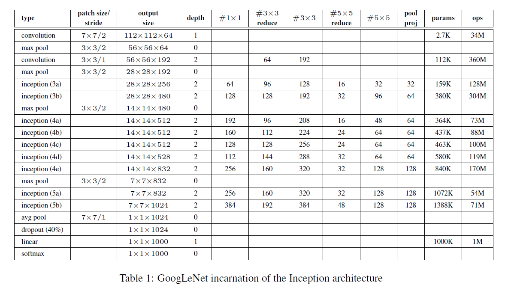

+ **一点总结:**

  a 22 layers deep network.

+ **背景? 提出了什么问题?**

  GoogLeNet取名源自作者所处单位(Google), 其中L大写是为了向LeNet致敬, 而Inception的名字来源于盗梦空间中的 "we need to go deeper".

+ **为了解决此问题提出了什么具体的idea?**

  使用稀疏连接的网络. 某一层激活的神经元只向下一层中特定的几个神经元传递激活信号, 而向其他神经元几乎不传递信息, 即仅有少部分连接是真正有效的, 这也是稀疏的含义.

  然而另一方面, 现代计算架构对稀疏的计算非常低效, 更适合的是密集的计算, 这样便产生了矛盾. 而Inception单元的提出就是为了用密集的结构来近似稀疏结构, 在建模稀疏连接的同时又能利用密集计算的优势.

  

  Inception: 把所有典型的网络层拼在一起, 让模型做选择, 模型自己对卷积核进行投票.

+ **如何从该idea形式化地对问题建模、简化并解决的?**

  + Inception Module:

    design a good local network topology. stack these modules on top of each other.

    

    

+ **理论方面证明的定理与推导过程?**

+ **这个任务/解决方法有什么意义?**

+ **对论文的讨论/感想?**


### ResNet

- [ ] **ResNet** (CVPR 2016) [[paperswithcode](https://paperswithcode.com/paper/deep-residual-learning-for-image-recognition) ([ResNet Explained](https://paperswithcode.com/method/resnet))]
    - He et al. "Deep Residual Learning for Image Recognition"


| 核心在哪? | 精读? 代码? | 关键词? | 亮点? | 笔记时间? |
| --------- | ----------- | ------- | ----- | --------- |
|           | 精读, 代码  |         |       |           |

---


+ **一点总结:**

  解决深网络退化 degradation problem: 网络层数多/饱和, 加更多层进去会导致优化困难、且训练误差和预测误差更大.

+ **背景? 提出了什么问题?**

  相关研究:

  + Residual Representations:

    对于VLAD和Fisher Vector, 残差向量编码比对原始向量编码效率更高.

    在PDE问题中...

  + Shortcut Connections:

    + An early practice of training multi-layer perceptrons(MLPs) is to add a linear layer connected from the network input to the output.
    + auxiliary classifiers 被用于解决 梯度消失/爆炸情形.
    + centering layer responses, gradients, and propagated errors, implemented by shortcut connections.

  

+ **为了解决此问题提出了什么具体的idea?**

  a deep residual learning framework.

  不是希望每几个堆叠层直接fit所需的underlying mapping, 而是显式地让这些层fit residual mapping.

+ **如何从该idea形式化地对问题建模、简化并解决的?**

  

  the desired underlying mapping $\mathcal{H}(x)$.

  > 假设 ![[公式]](assets/equation.svg) 与 ![[公式]](assets/equation.svg) 维度相同，那么拟合 ![[公式]](assets/equation.svg) 与拟合残差函数 ![[公式]](assets/equation-1602336827067.svg) 等价，令残差函数 ![[公式]](assets/equation.svg) ，则原函数变为 ![[公式]](assets/equation-1602336827068.svg) ，于是直接在原网络的基础上加上一个跨层连接，这里的跨层连接也很简单，就是 将![[公式]](assets/equation.svg) 的**恒等映射（Identity Mapping）**传递过去。

  > We hypothesize that it **is easier to** optimize the residual mapping than to optimize the original, unreferenced mapping. To the extreme, if an identity mapping were optimal, it would **be easier to push the residual to zero** than to fit an identity mapping by a stack of nonlinear layers.

  

  + 两个分支:

    $F(x)$ residential mapping, $x$ identity mapping.

  + **a building block:**
    $$
    \mathbf{y}=\mathcal{F}\left(\mathbf{x},\left\{W_{i}\right\}\right)+\mathbf{x}
    $$
    其中 $\mathcal{F}\left(\mathbf{x},\left\{W_{i}\right\}\right)$ 是拟合的residential mapping. 上图中 两层, 省略bias 即:
    $$
    F=W_{2} \sigma\left(W_{1} x\right)
    $$
    如果 $\mathcal{F}$ 和 $x$ 同一维度, 那么直接加, 反之给一个线性映射:
    $$
    \mathbf{y}=\mathcal{F}\left(\mathbf{x},\left\{W_{i}\right\}\right)+W_{s} \mathbf{x}
    $$
  
+ **网络结构:**
  
  + Plain Network:
  
    > The convolutional layers mostly have 3x3 filters and follow two simple design rules:
      >
      > (i) for the same output feature map size, the layers have the same number of filters;
      >
      > (ii) if the feature map size is halved, the number of filters is doubled so as to preserve the time complexity per layer.
  
    plain 就是没有residential的.
  
  + Residual Network:
  
    在plain的基础上加shortcut.
  
+ **理论方面证明的定理与推导过程?**

+ **这个任务/解决方法有什么意义?**

+ **对论文的讨论/感想?**


### DenseNet

- [x] **DenseNet** (CVPR 2017) [[paperswithcode](https://paperswithcode.com/paper/densely-connected-convolutional-networks)]
    - Huang et al. "Densely Connected Convolutional Networks"


| 核心在哪? | 精读? 代码? | 关键词? | 亮点? | 笔记时间? |
| --------- | ----------- | ------- | ----- | --------- |
|           |             |         |       |           |

---

connects each layer to every other layer in a feed-forward fashion.

将shortcut-connection的思路发挥到极致. 连接shortcut的方式(不是ResNet的相加)是concatenate. 提升了信息和梯度在网络中的流动, 使网络更容易去训练.

> 在神经网络的前向传递中，每一层都和前面的所有层直接连接，每层的输入来自于之前所有层的输出。一个普通的有L层的神经网络会产生L个层与层之间的连接，而同样是L层的DenseNet则会因为它层与层相互连接的特点，产生多达 $\frac{L(L+1)}{2}$ 个连接。

+ **背景? 提出了什么问题?**

+ **为了解决此问题提出了什么具体的idea?**

+ **如何从该idea形式化地对问题建模、简化并解决的?**

  + **Dense connectivity:**

    

    Figure 1 illustrates the layout of the resulting DenseNet schematically. Consequently, the $\ell^{t h}$ layer receives the feature-maps of **all preceding layers**, $\mathrm{x}_{0}, \ldots, \mathrm{x}_{\ell-1},$ as input:
    $$
    \mathbf{x}_{\ell}=H_{\ell}\left(\left[\mathbf{x}_{0}, \mathbf{x}_{1}, \ldots, \mathbf{x}_{\ell-1}\right]\right)
    $$
    
    where $\left[\mathrm{x}_{0}, \mathrm{x}_{1}, \ldots, \mathrm{x}_{\ell-1}\right]$ refers to **the concatenation of the feature-maps** produced in layers $0, \ldots, \ell-1$.
    
  + **Composition function:**
  
    $H_{\ell}(\cdot)$ 为三个consecutive操作: batch normalization, ReLU, $3 \times 3$ 卷积.
  
  + **Pooling layers:**
  
    网络划分为多个密集连接的block, block之间的连接层称为transition layers, 主要进行卷积和池化: 
  
    
  
  + **Bottleneck layers:**
  
    It has been noted in [37, 11] that a **1x1 convolution** can be introduced as bottleneck layer before each 3x3 convolution **to reduce the number of input feature-maps**, and thus to **improve computational efficiency**.
  
  
  
  + **Model:**
  
    
  
    因为不断拼接了之前的层, 所以维度越到后面是不断变大的.


+ **理论方面证明的定理与推导过程?**
+ **这个任务/解决方法有什么意义?**
+ **对论文的讨论/感想?**

## Meta Learning

如何才能让模型仅用少量的数据学习? 
我们期望好的meta learning模型能够具备**强大的适应能力和泛化能力**. 在测试时, 模型会先经过一个自适应环节（adaptation process）, 即根据少量样本学习任务. 自适应本质上来说就是一个短暂的学习过程.

最佳的meta learning模型参数可以表示为:
$$
\theta^{*}=\arg \min _{\theta} \mathbb{E}_{\mathcal{D} \sim p(\mathcal{D})}\left[\mathcal{L}_{\theta}(\mathcal{D})\right]
$$
上式中的每个*数据集*是一个*数据样本*. Few-shot Learning中数据集 $\mathcal{D}$ 被分为 support set/query set.

Training Set 是 Support Set, Test Set 是 Query Set.

+ $\star$ N-ways K-shot classification:

  在 Training 和 Test Tasks 里, 有 N 个类别, 每个类别有 K 个用例.


### Siamese Network

- [x] **Siamese Network** (ICML 2015) [[paper](https://www.cs.cmu.edu/~rsalakhu/papers/oneshot1.pdf)] [[code (keras)](https://github.com/tensorfreitas/Siamese-Networks-for-One-Shot-Learning)]
    - Gregory Koch et al. "Siamese Neural Networks for One-shot Image Recognition"


| 核心在哪?   | 精读? 代码? | 关键词? | 亮点? | 阅读时间? |
| ----------- | ----------- | ------- | ----- | --------- |
| Model 3.1节 | 精读        |         |       | 2020-10-2 |

---

+ **提出了什么问题?**

+ **为了解决此问题提出了什么具体的idea?**

  

+ **如何从该idea形式化地对问题建模、简化并解决的?**

  + **Model:**
    $$
    \begin{aligned}
    a_{1, m}^{(k)} &=\text{max-pool}\left(\max \left(0, \mathbf{W}_{l-1, l}^{(k)} \star \mathbf{h}_{1,(l-1)}+\mathbf{b}_{l}\right), 2\right) \\
    a_{2, m}^{(k)} &=\text{max-pool}\left(\max \left(0, \mathbf{W}_{l-1, l}^{(k)} \star \mathbf{h}_{2,(l-1)}+\mathbf{b}_{l}\right), 2\right)
    \end{aligned}
    $$
    共享参数.

    **预测(输出层):**
    $$
    \mathbf{p} = \sigma\left(\sum_{j} \alpha_{j}\left|\mathbf{h}_{1, L-1}^{(j)}-\mathbf{h}_{2, L-1}^{(j)}\right|\right)
    $$
    请注意**最关键**就在上述式子, $x$ embedding之后比较距离, 接softmax转换成概率.

    > This final layer induces a metric on the **learned** feature space of the (L - 1)th hidden layer and **scores** the similarity between the two feature vectors.

    **loss function:**
    $$
    \begin{array}{c}
    \mathcal{L}\left(x_{1}^{(i)}, x_{2}^{(i)}\right)=\mathbf{y}\left(x_{1}^{(i)}, x_{2}^{(i)}\right) \log \mathbf{p}\left(x_{1}^{(i)}, x_{2}^{(i)}\right)+ \\
    \left(1-\mathbf{y}\left(x_{1}^{(i)}, x_{2}^{(i)}\right)\right) \log \left(1-\mathbf{p}\left(x_{1}^{(i)}, x_{2}^{(i)}\right)\right)+\boldsymbol{\lambda}^{T}|\mathbf{w}|^{2}
    \end{array}
    $$
    正类: 两个同一个类, 相似, 即 $\mathbf{y}\left(x_{1}^{(i)}, x_{2}^{(i)}\right) = 1$, 反之等于0.

    

    **Optimization:**
    $$
    \begin{array}{c}
    \mathbf{w}_{k j}^{(T)}\left(x_{1}^{(i)}, x_{2}^{(i)}\right)=\mathbf{w}_{k j}^{(T)}+\Delta \mathbf{w}_{k j}^{(T)}\left(x_{1}^{(i)}, x_{2}^{(i)}\right)+2 \lambda_{j}\left|\mathbf{w}_{k j}\right| \\
    \Delta \mathbf{w}_{k j}^{(T)}\left(x_{1}^{(i)}, x_{2}^{(i)}\right)=-\eta_{j} \nabla w_{k j}^{(T)}+\mu_{j} \Delta \mathbf{w}_{k j}^{(T-1)}
    \end{array}
    $$

    > the gradient is additive **across the twin networks** due to the tied weights.

    > **learning rates** were decayed uniformly across the network by 1 percent per epoch, so that $\eta_{j}^{(T)}=0.99 \eta_{j}^{(T-1)}$.

    > We used the beta version of Whetlab, a Bayesian optimization framework, to perform **hyperparameter selection**.

    **Weight initialization:**

    卷积层: $\mathcal{N}(0, 10^{-2})$, bias: $\mathcal{N}(0.5, 10^{-2})$.

    **Affine distortions:**
    $$
    \mathrm{x}_{1}^{\prime}=T_{1}\left(\mathrm{x}_{1}\right), \mathrm{x}_{2}^{\prime}=T_{2}\left(\mathrm{x}_{2}\right)
    $$
    其中$T_i$是 multidimensional uniform distribution 中随机选取的.

    

+ **理论方面证明的定理与推导过程?**

+ **这个任务/解决方法有什么意义?**

  假设: 学到的 embedding 在未见过的分类上依然能很好的衡量图片间的距离, 这与迁移学习中是一致的.

  > a) are capable of **learning generic image features** useful for making predictions about unknown class distributions even when very few examples from these **new distributions are available**;
  >
  > b) are easily trained **using standard optimization techniques** on pairs sampled from the source data;
  >
  > c) provide a competitive approach that **does not rely** upon **domain-specific** knowledge by instead exploiting deep learning techniques.

  

+ **对论文的讨论/感想?**

  关注Siamese的不足在哪, 似乎没有考虑其他训练集数据的影响, 就只是与单一对的0/1比较? 对比matching和Prototypical.


### Matching Networks

- [x] **Matching Networks** (NIPS 2016) [[paper](https://arxiv.org/abs/1606.04080)] [[code (PyTorch)](https://github.com/oscarknagg/few-shot/blob/master/few_shot/matching.py)]
    - Oriol Vinyals et al. "Matching Networks for One Shot Learning"


| 核心在哪?              | 精读? 代码? | 关键词? | 亮点? | 阅读时间? |
| ---------------------- | ----------- | ------- | ----- | --------- |
| 2.1.1, 2.1.2, Appendix | 精读        |         |       | 2020-10-2 |

---

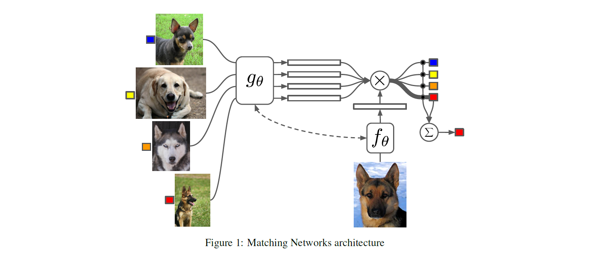

+ **背景? 提出了什么问题?**

  > a neural attention mechanism, often fully differentiable, is defined to access (or read) a memory matrix which stores useful information to solve the task at hand.

  

+ **为了解决此问题提出了什么具体的idea?**

  > cast the problem of one-shot learning within the set-to-set framework

  > reinterpreting a well studied framework (neural networks with external memories) to do one-shot learning.

  分到某个类的权重由在 support set 中一系列label的加权和, **权重由一个注意力核** (attention kernel) $a(\mathbf{x}, \mathbf{x}_i)$ 决定.

  权重应当与 $\mathbf{x}_i$ 和 $\mathbf{x}_i$ 间的相似度成正比.

+ **如何从该idea形式化地对问题建模、简化并解决的?**
  $$
  \hat{y}=\sum_{i=1}^{k} a\left(\hat{x}, x_{i}\right) y_{i}
  $$
  Attention kernel由两个embedding function $f$ 和 $g$ 决定.

  分别用于encoding测试样例和支持集样本. 两个样本之间的注意力权重是经过softmax归一化后的, embedding vectors之间cosine距离 $\operatorname{cosine}( \cdot)$.
  $$
  a\left(\mathbf{x}, \mathbf{x}_{i}\right)=\frac{\exp \left(\operatorname{cosine}\left(f(\mathbf{x}), g\left(\mathbf{x}_{i}\right)\right)\right.}{\sum_{j=1}^{k} \exp \left(\operatorname{cosine}\left(f(\mathbf{x}), g\left(\mathbf{x}_{j}\right)\right)\right.}
  $$
  
  

  + **Full Context Embeddings**:
  
    **只把一个数据样本作为embedding function的输入, 会导致很难高效的估计出整个特征空间.**
  
    通过把整个支持集 $S$ 作为embedding function的额外输入来加强embedding的有效性, 相当于给样本**添加了语境**, 让embedding根据样本与支持集中**样本的关系进行调整.**
  
    以下看Appendix:
  
    $g_{\theta}\left(\mathbf{x}_{i}, S\right)$ 在整个支持集 $S$ 的语境下用一个双向LSTM来编码 $\mathbf{x}_{i}$
    $f_{\theta}(\mathbf{x}, S)$ 在支持集 $S$ 上使用read attention机制编码测试样本 $\mathbf{x}$
  
    1. 首先测试样本经过一个简单的神经网络, 比如CNN以抽取基本特征 $f^{\prime}(\mathbf{x})$.
    2. 然后, 一个**带有read attention vector的LSTM**被训练用于生成部分hidden state:
    $$
    \begin{aligned}
    \hat{\mathbf{h}}_{t}, \mathbf{c}_{t} &=\operatorname{LSTM}\left(f^{\prime}(\mathbf{x}),\left[\mathbf{h}_{t-1}, \mathbf{r}_{t-1}\right], \mathbf{c}_{t-1}\right) \\
    \mathbf{h}_{t} &=\hat{\mathbf{h}}_{t}+f^{\prime}(\mathbf{x}) \\
    \mathbf{r}_{t-1} &=\sum_{i=1}^{k} a\left(\mathbf{h}_{t-1}, g\left(\mathbf{x}_{i}\right)\right) g\left(\mathbf{x}_{i}\right) \\
    a\left(\mathbf{h}_{t-1}, g\left(\mathbf{x}_{i}\right)\right) &=\operatorname{softmax}\left(\mathbf{h}_{t-1}^{\top} g\left(\mathbf{x}_{i}\right)\right)=\frac{\exp \left(\mathbf{h}_{t-1}^{\top} g\left(\mathbf{x}_{i}\right)\right)}{\sum_{j=1}^{k} \exp \left(\mathbf{h}_{t-1}^{\top} g\left(\mathbf{x}_{j}\right)\right)}
    \end{aligned}
    $$
    3. 最终, 如果我们做k步的读取 $f(\mathbf{x}, S)=\mathbf{h}_{K}$.
  
    这类方法对于困难的任务 (few-shot classification on mini ImageNet) 有所帮助.
  
+ **理论方面证明的定理与推导过程?**

  > We propose embedding the elements of the set through a function which takes as input the full set $S$ in addition to $x_{i},$ i.e. $g$ becomes $g\left(x_{i}, S\right) .$ Thus, as a function of the whole support set $S, g$ can modify how to embed $x_{i} .$ This could be useful when some element $x_{j}$ is very close to $x_{i},$ in which case it may be beneficial to change the function with which we embed $x_{i}-$ some evidence of this is discussed **in Section 4** . We use a bidirectional Long-Short Term Memory (LSTM) [8] to encode $x_{i}$ in the context of the support set $S,$ considered as a sequence (**see appendix** for a more precise definition).

  

+ **这个任务/解决方法有什么意义?**

+ **对论文的讨论/感想?**


### Prototypical Networks

- [x] **Prototypical Networks** (NIPS 2017) [[paper](https://arxiv.org/abs/1703.05175)] [[code](https://github.com/jakesnell/prototypical-networks)]
  - Snell et al. "Prototypical Networks for Few-shot Learning"

| 核心在哪?   | 精读? 代码? | 关键词?               | 亮点?    | 笔记时间? |
| ----------- | ----------- | --------------------- | -------- | --------- |
| Model 2.2节 | 精读        | Prototypical Networks | 新的网络 | 2020-10-2 |

---


+ **提出了什么问题?**

+ **为了解决此问题提出了什么具体的idea?**

  对于meta-data, 学到它们的embedding (non-linear mapping), 在shared space构建每个类的prototype. 对于query set的, 先embedding, 再找最相邻的prototype.


+ **如何从该idea形式化地对问题建模、简化并解决的?**

  + **Model:**

    **embedding function** $f_{\phi}: \mathbb{R}^D \rightarrow \mathbb{R}^M$, 参数 $\phi$. prototype $\mathbf{c}_{k}$ 是 support set 里面数据的embedding后均值:
    $$
    \mathbf{c}_{k}=\frac{1}{\left|S_{k}\right|} \sum_{\left(\mathbf{x}_{i}, y_{i}\right) \in S_{k}} f_{\boldsymbol{\phi}}\left(\mathbf{x}_{i}\right)
    $$
    对于每个query point $x$, 基于"距离"原型网络建立了该点到 每个原型$\mathbf{c}_{k}$的概率分布:
    $$
    p_{\boldsymbol{\phi}}(y=k \mid \mathbf{x})=\frac{\exp \left(-d\left(f_{\boldsymbol{\phi}}(\mathbf{x}), \mathbf{c}_{k}\right)\right)}{\sum_{k^{\prime}} \exp \left(-d\left(f_{\boldsymbol{\phi}}(\mathbf{x}), \mathbf{c}_{k^{\prime}}\right)\right)}
    $$

  + **学习过程:**

    通过SGD最小化负对数概率 (到每个原型的): $J(\boldsymbol{\phi})=-\log p_{\boldsymbol{\phi}}(y=k \mid \mathbf{x})$

    

    **training episode**是training set的随机选取的子集, 在每个类中选择一些作为support set, 其余是query set. 结合episodes和mini-batch的思路模拟测试场景进行训练.

    伪代码:

    

    

  + 学习过程是 Mixture Density Estimation:

    使用[Bregman散度](https://www.zhihu.com/question/22426561/answer/209945856), 相当于在support set上用指数族 混合密度估计. Bregman定义如下:
    $$
    d_{\varphi}\left(\mathbf{z}, \mathbf{z}^{\prime}\right)=\varphi(\mathbf{z})-\varphi\left(\mathbf{z}^{\prime}\right)-\left(\mathbf{z}-\mathbf{z}^{\prime}\right)^{T} \nabla \varphi\left(\mathbf{z}^{\prime}\right)
    $$
    where $\varphi$ is a differentiable, strictly convex function of the Legendre type.

    注意Bregman散度 通过改变$\varphi$ 可以生成不同的距离度量: 

    为什么选择均值作为 prototype:
    It has been shown [4] for Bregman divergences that the cluster representative achieving minimal distance to its assigned points is the cluster mean.

    下面似乎是直接写出了混合密度估计中后验的表达式(指数族混合模型), 关于Bregman散度: 

    

  + 作为线性模型的解释:
    $$
    -\left\|f_{\phi}(x)-c_{k}\right\|^{2}=-f_{\phi}(x)^{T} f_{\phi}(x)+2 c_{k}^{T} f_{\phi}(x)-c_{k}^{T} c_{k}
    $$
    RHS 第一项不变, 所以后面对应线性模型有:
    $$
    2 c_{k}^{T} f_{\phi}(x)-c_{k}^{T} c_{k}=w_{k}^{T} f_{\phi}(x)+b_{k}, \text { 其中 } w_{k}=2 c_{k}, b_{k}=-c_{k}^{T} c_{k}
    $$
    这个假设是基于: all of the required non-linearity can be learned within the embedding function.

  

+ **理论方面证明的定理与推导过程?**

  [4] Arindam Banerjee, Srujana Merugu, Inderjit S Dhillon, and Joydeep Ghosh. Clustering with bregman divergences. Journal of machine learning research, 6(Oct):1705–1749, 2005.

  

+ **这个任务/解决方法有什么意义?**

+ **对论文的讨论/感想?**

  注意考虑模型和其他之间的关联(比如上面和混合密度估计/线性模型).

  学习过程的细节? $\mathbf{c}_k$ 是不断变化的.


### Relation Network

- [x] **Relation Network** (CVPR 2018) [[paper](https://openaccess.thecvf.com/content_cvpr_2018/papers_backup/Sung_Learning_to_Compare_CVPR_2018_paper.pdf)] [[code (PyTorch)](https://github.com/floodsung/LearningToCompare_FSL)]
    - Sung et al. "Learning to Compare: Relation Network for Few-Shot Learning"


| 核心在哪?                          | 精读? 代码? | 关键词? | 亮点? | 阅读时间? |
| ---------------------------------- | ----------- | ------- | ----- | --------- |
| 3.2 Model 3.4 Network Architecture | 精读        |         |       | 2020-10-3 |

---

 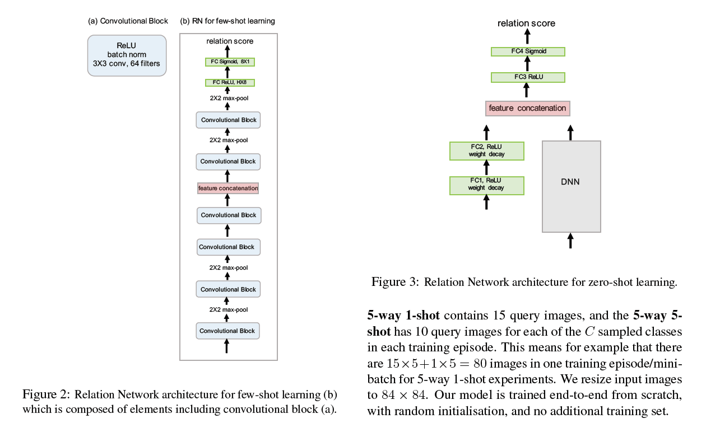

+ **背景? 提出了什么问题?**

  

+ **为了解决此问题提出了什么具体的idea?**

  > As most few-shot learning models utilize four convolutional blocks for embedding module [39, 36], we follow the same architecture setting for fair comparison, see Figure 2.

  > More concretely, each convolutional block contains a 64-
  > filter `3 x 3` convolution, a batch normalization and a ReLU nonlinearity layer respectively. The first two blocks also contain a `2 x 2` max-pooling layer while the latter two do not.

  

+ **如何从该idea形式化地对问题建模、简化并解决的?**

  + **Model:** (Figure 1)

    **1 an embedding module $f_\varphi$:**

    feature maps & combine(a concatenation):
    $$
    \mathcal{C}\left(f_{\varphi}\left(x_{i}\right), f_{\varphi}\left(x_{j}\right)\right)
    $$
    

    **2 a relation module $g_\varphi$:**

    生成 relation score: $\in [0, 1]$ **representing the similarity** between $x_i$ and $x_j$:
    $$
    r_{i, j}=g_{\phi}\left(\mathcal{C}\left(f_{\varphi}\left(x_{i}\right), f_{\varphi}\left(x_{j}\right)\right)\right), \quad i=1,2, \ldots, C
    $$
  
+ 损失函数:
  
  目标优化函数是MSE损失, 而不是cross-entropy, 因为RN在预测时更倾向于把相似系数预测过程**作为一个regression问题**, 而不是二分类问题.
  $$
    \varphi, \phi \leftarrow \underset{\varphi, \phi}{\operatorname{argmin}} \sum_{i=1}^{m} \sum_{j=1}^{n}\left(r_{i, j}-1\left(y_{i}==y_{j}\right)\right)^{2}
  $$

+ **理论方面证明的定理与推导过程?**
+ **这个任务/解决方法有什么意义?**
+ **对论文的讨论/感想?**


### MAML

- [ ] **MAML** (ICML 2017) [[paper](http://proceedings.mlr.press/v70/finn17a/finn17a.pdf)] [[code (原)](https://github.com/cbfinn/maml) [code(PyTorch)](https://github.com/dragen1860/MAML-Pytorch)]
    - Finn et al. "Model-Agnostic Meta-Learning for Fast Adaptation of Deep Networks"


| 核心在哪? | 精读? 代码? | 关键词? | 亮点? | 笔记时间? |
| --------- | ----------- | ------- | ----- | --------- |
|           | 精读        |         |       |           |

---

 

+ **背景? 提出了什么问题?**

+ **为了解决此问题提出了什么具体的idea?**

+ **如何从该idea形式化地对问题建模、简化并解决的?**

  假设我们的模型是 $f_{\theta}$, 参数为 $\theta$ 给定一个任务 $\tau_{i}$ 和其相应的数据集 $\left(\mathcal{D}_{\text {train }}^{(i)}, \mathcal{D}_{\text {test }}^{(i)}\right)$, 我们可以对模型参数进行一次或多次梯度下降. (下式中只进行了一次迭代):
  $$
  \theta_{i}^{\prime}=\theta-\alpha \nabla_{\theta} \mathcal{L}_{\tau_{i}}^{(0)}\left(f_{\theta}\right)
  $$
  其中 $\mathcal{L}^{(0)}$ 是由编号为0的小数据batch算得的loss.

  当然, 上面这个式子只针对一个特定的任务进行了优化. 而MAML为了能够更好地扩展到一系列任务上, 我们想要寻找一个在给定任意任务后**微调过程最高效的** $\theta^{*}$.

  现在假设我们采样了一个编号为1的数据batch用于更新元目标, 对应的loss记为 $\mathcal{L}^{(1)}$. $\mathcal{L}^{(0)}$ 和 $\mathcal{L}^{(1)}$ 的上标只代表着数据batch不同, 都是同一个目标方程计算得到的. 那么:
  $$
  \theta^{*}=\arg \min _{\theta} \sum_{\tau_{i} \sim p(\tau)} \mathcal{L}_{\tau_{i}}^{(1)}\left(f_{\theta_{i}^{\prime}}\right)=\arg \min _{\theta} \sum_{\tau_{i} \sim p(\tau)} \mathcal{L}_{\tau_{i}}^{(1)}\left(f_{\theta-\alpha \nabla_{\theta} \mathcal{L}_{\tau_{i}}^{(0)}\left(f_{\theta}\right)}\right)
  $$
  $$
  \theta \leftarrow \theta-\beta \nabla_{\theta} \sum_{\tau_{i} \sim p(\tau)} \mathcal{L}_{\tau_{i}}^{(1)}\left(f_{\theta-\alpha \nabla_{\theta}\mathcal{L}_{\tau_{i}}^{(0)}\left(f_{o}\right)}\right)
  $$
  https://lilianweng.github.io/lil-log/2018/11/30/meta-learning.html

  

  **湾湾李老师网课**:

  Meta Learning 就是找到Learning Algorithm $F$, 这个 $F$ 的能力是可以找到最优预测函数 $f^{\star}$.
  $$
  F(D_{train}) = f^{\star}
  $$
  Meta Learning 就是找到最好的 Learning Algorithm, 同样也可以有$loss$.

  以前的Initialization是从一个分布中采样, 现在就要学习一个Initialization.

  

  各变量解释看上图. 每一个小任务都是训练的过程.

  + 与 Model Pre-training 的区别:

    Model Pre-training 损失函数的自变量是超参数(这里就是$\phi$), 但是MAML的损失函数自变量是 经过 $F$ 学习得到的 $f$ 的最优参数在test set上的损失.

    Model Pre-training 关注的是即刻的 $\phi$ 给进去loss如何, 而 MAML 关注的是经过训练后怎么样.

    MAML 并不在意Initialization: $\phi$ 在 training Task(set) 上的表现, 而是经过 $\phi$ 训练出来的 $f^{\star}$/$\hat{\theta}$ 的表现. $|$ 即对于学习器的loss(上面有): $l^i(\phi)$ 可能不是很好, 但是经过这个 $\phi$ 训练过后的 $\hat{\theta}$ 也就是 $l^i(\hat{\theta})$ 可能很好. 不同Task的$\hat{\theta}$当然不同:

    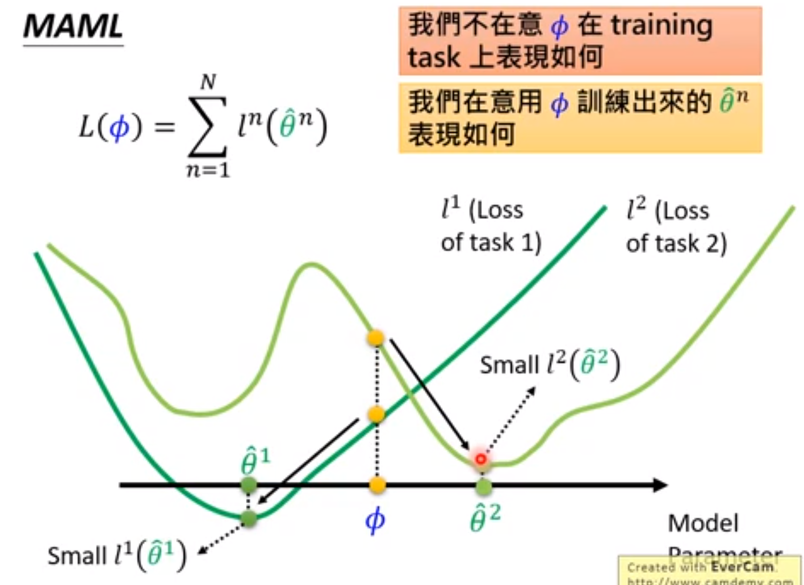

    

  + 训练细节:

    在训练的时候希望 Gradient Update 一次就到最优, 但是测试时可以Update多次.

    Few-Shot Learning 就希望只Update一次.

  + Toy Example:

    有一个 $y$, 一个Task就是从 $y$ 采样出不同的 $x$, 通过这些采样的来估测$y$的形式.
    $$
    y = a \sin (x+ b)
    $$
    不同的Task: 选不同的 $a, \ b$ 即可.

    + Model Pre-training 的结果:

      

      因为拿 $\phi$ 要在所有 $y$ 上都表现好, 所有 $y$ 综合就是上图.

      

    + 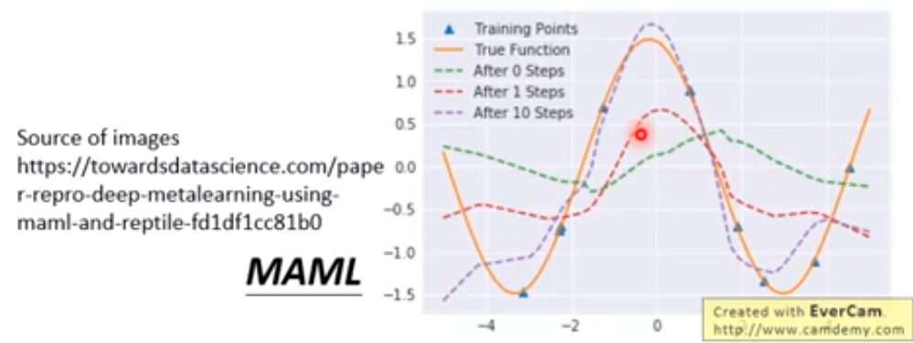

      

+ **理论方面证明的定理与推导过程?**

+ **这个任务/解决方法有什么意义?**

+ **对论文的讨论/感想?**


- **One-shot Learning with Memory-Augmented Neural Networks**, (2016), *Adam Santoro, Sergey Bartunov, Matthew Botvinick, Daan Wierstra, Timothy Lillicrap*. [[pdf\]](https://arxiv.org/pdf/1605.06065.pdf) [[code\]](https://github.com/vineetjain96/one-shot-mann)

### MANN

- [ ] **MANN** (2016) [[paper](https://arxiv.org/pdf/1605.06065.pdf)] [[code](https://github.com/tristandeleu/ntm-one-shot), [code (tf)](https://github.com/hmishra2250/NTM-One-Shot-TF)]
    - Santoro et al. "One-shot Learning with Memory-Augmented Neural Networks"


| 核心在哪? | 精读? 代码? | 关键词? | 亮点? | 阅读时间? |
| --------- | ----------- | ------- | ----- | --------- |
|           |             |         |       |           |

---

+ **背景? 提出了什么问题?**
+ **为了解决此问题提出了什么具体的idea?**
+ **如何从该idea形式化地对问题建模、简化并解决的?**
+ **理论方面证明的定理与推导过程?**
+ **这个任务/解决方法有什么意义?**
+ **对论文的讨论/感想?**


### PFA

- [x] **PFA** (CVPR 2018) [[paperswithcode](https://paperswithcode.com/paper/few-shot-image-recognition-by-predicting)]
    - Qiao et al. "Few-Shot Image Recognition by Predicting Parameters from Activations"


| 核心在哪? | 精读? 代码? | 关键词?                    | 亮点?                    | 笔记时间? |
| --------- | ----------- | -------------------------- | ------------------------ | --------- |
| 2. Model  | 精读        | 激活值 -> 分类器权值的预测 | 采样，线性近似，混合策略 | 2020-10-3 |

---

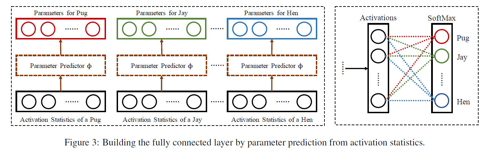 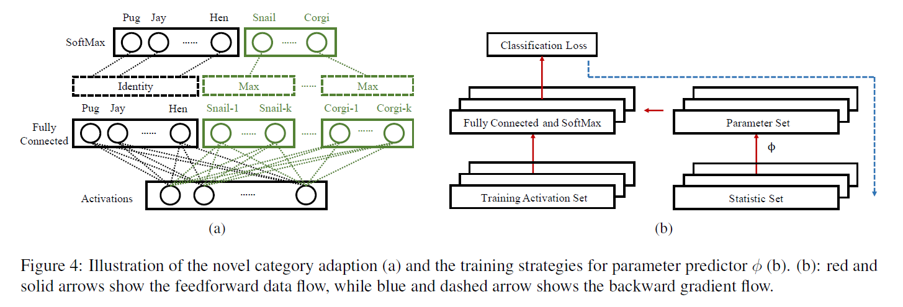


+ **背景? 提出了什么问题?**

  > We argue that a good classifier should **have the following properties:** 
  >
  > **(1)** It achieves reasonable performance on $\mathcal{C}_{\text {few}}$.
  > **(2)** Adapting to $\mathcal{C}_{\text {few }}$ does not degrade the performance on $\mathcal{C}_{\text {large }}$ significantly (if any).
  > **(3)** It is fast in inference and adapts to few-shot categories with little or zero training, i.e., an efficient lifelong learning system.
  >
  > However, due to the limited number of samples in $\mathcal{D}_{\text{few}}$ and the **imbalance** between $\mathcal{D}_{\text {large}}$ and $\mathcal{D}_{\text {few}}$, parametric models usually **fail to learn well from the training samples.**
  >
  > On the other hand, many **non-parametric** approaches such as nearest neighbors can adapt to the novel concepts easily without severely forgetting the original classes. **But this requires careful designs of the distance metrics,** which can be difficult and sometimes empirical. To remedy this, some previous work instead adapts feature representation to the metrics by using Siamese networks.
  >
  > As we will show later through experiments, these methods do not fully satisfy the properties mentioned above.

  $\mathcal{D}_{\text {large}}$ 就是support set, 对应的 $\mathcal{D}_{\text{few}}$ 是query set.

  + how to **re-parameterize** the last fully connected layer to include the novel categories under the few-shot constraints, *i.e.*, for each category in $\mathcal{C}_{few}$ we have only a few examples.

  we believe **the activations and the parameters** have similar **local and global structure** in their respective space.

$\mathcal{D}_{\text {large}}$ 上学到的, 泛化到 $\mathcal{C}_{\text {few}}$.

+ **为了解决此问题提出了什么具体的idea?**

  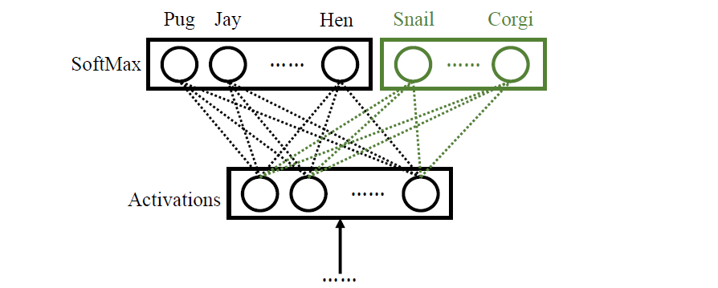

  上图是最后的全连接层和softmax层.

  + $\mathbf{w}_y \in \mathbb{R}^n$ 是全连接层对应类别 $y$ 的参数.
  + $\mathbf{a} (x) \in \mathbb{R}^n$ 是图像 $x$ 的 在全连接层之前的 激活层值.

  > how to **re-parameterize** the last fully connected layer to include the novel categories under the few-shot constraints, *i.e.*, for each category in $\mathcal{C}_{few}$ we have only a few examples.

  解决上述挑战就是:

  **使用激活值直接预测 $\mathbf{w}_y$**, $i.e.$, $\mathcal{A}_{y}=\left\{\mathbf{a}(x) \mid x \in \mathcal{D}_{\text {large }} \cup \mathcal{D}_{\text {few }}, Y(x)=y\right\}, \text { where } Y(\cdot) \text { denotes the category of the image. }$

  

  + $\overline{\mathbf{a}}_{y} \in \mathbb{R}^{n}$ 是 $\mathcal{A}_y$ 中所有元素的均值.

  **直觉上, 想让 $\mathbf{w}_y \cdot \mathbf{a}_y$ 尽可能大.**

+ **如何从该idea形式化地对问题建模、简化并解决的?**

  **直觉上, 想让 $\mathbf{w}_y \cdot \mathbf{a}_y$ 尽可能大.**

  > To verify this intuition, we use [**t-SNE**](https://en.wikipedia.org/wiki/T-distributed_stochastic_neighbor_embedding) to **visualize the neighbor embeddings** of the activation statistic $\overline{\mathbf{a}}_{y}$ and the parameters $\mathbf{w}_{y}$ for each category of a pre-trained deep neural network, as shown in Figure $2$. Comparing them and we observe a high similarity **in both the local and the global structures.** More importantly, **the semantic structures** are also **preserved** in both activations and parameters, indicating **a promising generalizability to unseen categories.**

  依据: 通过**t-SNE**将激活值可视化后, $\overline{\mathbf{a}}_{y}$ 与对应类别的分类权重 $w_y$ 非常接近.

  使用 the semantic structures. **学到一个好的 category-agnostic**
  **mapping**: from the activations to the parameters given a good feature extractor $a( \cdot )$. 这个mapping由神经网络来学.

  

  
  $$
  \text { parameter predictor } \phi: \overline{\mathbf{a}}_{y} \rightarrow \mathbf{w}_{y}
  $$

  + **学习过程**: $\phi$ 在 $y \in \mathcal{C}_{large}$ 就是 support set
    $$
    \mathcal{L}(\phi)=\sum_{(y, x) \in \mathcal{D}_{\text {large }}}\left[-\phi\left(\overline{\mathbf{a}}_{y}\right) \mathbf{a}(x)+\log \sum_{y^{\prime} \in \mathcal{C}_{\text {large }}} e^{\phi\left(\overline{\mathbf{a}}_{y^{\prime}}\right) \mathbf{a}(x)}\right]+\lambda\|\phi\|
    $$
    但是, 因为query set上可能每一类只有一个, 这样 $\overline{\mathbf{a}}_{y}$ 可能不具有代表性了, 解决方法就是**采样:**

    one-shot, 构建新的集合, 并从中**取一个 统计量:**
    $$
    \mathbf{s}_{y} \in \mathcal{A}_{y} \cup \overline{\mathbf{a}}_{y}
    $$
    **关键:** 以 $p_{mean}$ 的概率取 $\overline{\mathbf{a}}_{y}$, 反之取 $\mathcal{A}_y$ 中的元素.

    $S_{large} = \left\{\mathbf{s}_{1}, \ldots, \mathbf{s}_{\mid \mathcal{C}_{\text {large}}|}\right\}$

    新的损失函数:
    $$
    \mathcal{L}(\phi)=\sum_{(y, x) \in \mathcal{D}_{\operatorname{large}}} \mathbb{E}_{S_{\mathrm{large}}}\left[-\phi\left(\mathbf{s}_{y}\right) \mathbf{a}(x)+\log \sum_{y^{\prime} \in \mathcal{C}_{\operatorname{large}}} e^{\phi\left(\mathbf{s}_{y^{\prime}}\right) \mathbf{a}(x)}\right]+\lambda\|\phi\|
    $$
    以上, models the sampling from one-shot and mean activations.

  + 后验:
    $$
    P(y \mid x)=e^{\mathbb{E}_{S}\left[\phi\left(\mathbf{s}_{y}\right) \mathbf{a}(x)\right]} /\left(\sum_{y^{\prime} \in \mathcal{C}} e^{\mathbb{E}_{S}\left[\phi\left(\mathbf{s}_{y^{\prime}}\right) \mathbf{a}(x)\right]}\right)
    $$
    为了计算快速, 简化 $\phi$ 为线性映射:
    $$
    \begin{aligned}
    P(y \mid x) &=e^{\mathrm{a}(x) \cdot \phi\left(\mathbb{E}_{S}\left[\mathbf{s}_{y}\right]\right)} /\left(\sum_{y^{\prime} \in \mathcal{C}} e^{\mathbf{a}(x) \cdot \phi\left(\mathbb{E}_{S}\left[\mathbf{s}_{y^{\prime}}\right]\right)}\right) \\
    &=e^{\mathbf{a}(x) \cdot \Phi \cdot \mathbb{E}_{S}\left[\mathbf{s}_{y}\right]} /\left(\sum_{y^{\prime} \in \mathcal{C}} e^{\mathbf{a}(x) \cdot \Phi \cdot \mathbb{E}_{S}\left[\mathbf{s}_{y^{\prime}}\right]}\right)
    \end{aligned}
    $$
    上述简化(直接线性的方法) 和 采样的方法结合使用.

    其中 $\mathbb{E}_S\left[s_{y}\right]$ 可以在训练时提前计算好**并保存**下来. 在小样本数据集上进行训练时, 对于新的类别需要更新 $\mathbb{E}_S\left[s_{y}\right]$, 但由于小样本数量较少, 计算得到的$\mathbb{E}_S\left[s_{y}\right]$可靠性不高, 采用了一种混合策略:

    + 对于大规模数据集中的类别, 直接使用训练得到的 $\mathbb{E}_S\left[s_{y}\right]$ 简化的线性近似.
    + 对于小样本数据集中的类别, 使用类别 $y$ 对应的所有统计值 $s_{y}$ 与 query set图像 $x^{\prime}$ 的激活值 $a\left(x^{\prime}\right)$ **内积的最大值**, 来作为分类器的输出. 该过程如下所示:

    > 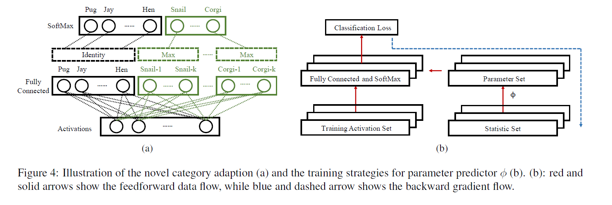
    >
    > **(4a)** For each novel category in $C_{few}$, we compute the **maximal** response of the activation of the test image to **the parameter set predicted from each activation in the statistic set of the corresponding novel category in $C_{few}$.**
    >
    > We use them as the inputs to the SoftMax layer to compute the probabilities.

    

  + **总结:**

    利用一个网络 $\phi$, 根据每类样本的激活向量平均值 $\overline{\mathbf{a}}_{y}$ (对于 query set 中的元素有采样), 来预测分类器中全连接层的权重.

    

+ **理论方面证明的定理与推导过程?**

+ **这个任务/解决方法有什么意义?**

+ **对论文的讨论/感想?**

  如果把线性变换矩阵 $\Phi$ 设为单位矩阵, 那么:
  $$
  a(x) \cdot \Phi \cdot \mathbb{E}_{S}\left(s_{y}\right) \Rightarrow a(x) \cdot \mathbb{E}_{S}\left(s_{y}\right)
  $$
  相当于计算 $a(x)$ 和 $\mathbb{E}_{S}\left(s_{y}\right)$ 之间的余弦相似性, 对于类别表征 (或者说原型 prototype) 的计算中增加了一个随机采样的过程和一个可学习的线性变换 $\phi$, 当然如果不把 $\phi$ 近似为线性变换, 其性能可能会更高, 但计算复杂度也会大幅上升.


### TADAM (难)

- [x] **TADAM** (NIPS 2018) [[paperswithcode](https://paperswithcode.com/paper/tadam-task-dependent-adaptive-metric-for)]
    - Boris N. Oreshkin et al. "TADAM: Task dependent adaptive metric for improved few-shot learning"


| 核心在哪? | 精读? 代码? | 关键词? | 亮点?                                             | 笔记时间? |
| --------- | ----------- | ------- | ------------------------------------------------- | --------- |
|           | 精读        |         | 1. scale metric, 2. TEN结构, 3. 辅助任务合作训练. |           |

---

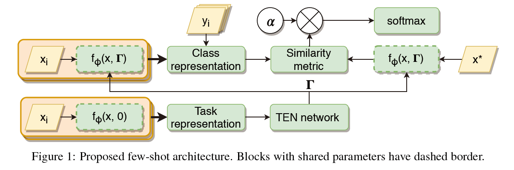

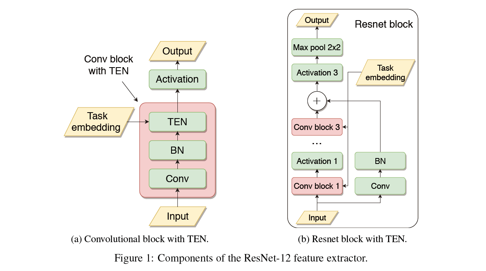 

+ **背景? 提出了什么问题?**

  学到一个context的度量空间, 即学习一个合适的相似性度量, 提取输入数据的特征后, 将其映射到similarity space.

  similarity metric 和 cost function 之间的 non-trivial interaction 可以通过 scaling 来提高性能.


+ **为了解决此问题提出了什么具体的idea?**

  metric scaling and metric task conditioning

  + M-shot, K-way.

  + **feature extractor**:
    $$
    f_{\phi}: \mathbb{R}^{D_{\mathbf{x}}} \rightarrow \mathbb{R}^{D_{\mathbf{z}}}
    $$
    这里 $f_{\phi} (x)$ 可以被直接用来解决问题 (比如matching, prototype就是这么做的).

  + **similarity measure** $d: \mathbb{R}^{D_{\mathbf{z}} \times D_{\mathbf{z}}} \rightarrow \mathbb{R}$

    $d$ 并不满足度量的基本性质 (non-negativity, symmetry, subadditivity).

    

  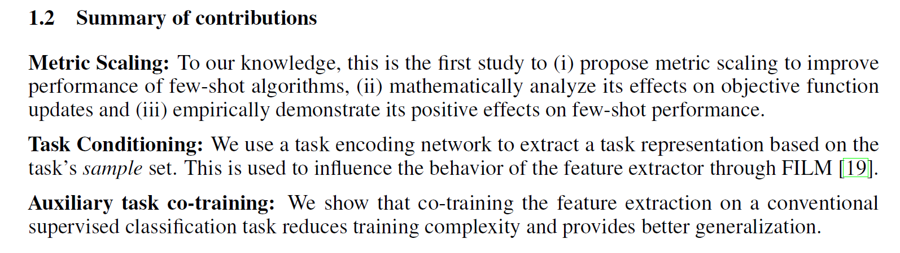

  + 采用 metric scaling, 并数学上分析.
  + task encoding network.
  + co-training the feature extraction on a conventional supervised classification task.

  

+ **如何从该idea形式化地对问题建模、简化并解决的?**

  + **model**:

    **1 scale** the distance metric, **乘一个 $\alpha$,** $\alpha \ d(\cdot, \cdot)$.

    在计算完距离度量后学习一个scaling factor.
    
    此时该metric的学习过程, the class-wise cross-entropy loss function:
    $$
    J_{k}(\phi, \alpha)=\sum_{\mathbf{x}_{i} \in \mathcal{Q}_{k}}\left[\alpha d\left(f_{\phi}\left(\mathbf{x}_{i}\right), \mathbf{c}_{k}\right)+\log \sum_{j} \exp \left(-\alpha d\left(f_{\phi}\left(\mathbf{x}_{i}\right), \mathbf{c}_{j}\right)\right)\right]
    $$
    其中 $\mathcal{Q}_k$ 是query set, 第 $k$ 类.
    
    对 $\phi$ 求导, (就是内函数外函数导数)有 注意 $\alpha$ 提到外面了:
    $$
    \frac{\partial}{\partial \phi} J_{k}(\phi, \alpha)=\alpha \sum_{\mathbf{x}_{i} \in \mathcal{Q}_{k}}\left[\frac{\partial}{\partial \phi} d\left(f_{\phi}\left(\mathbf{x}_{i}\right), \mathbf{c}_{k}\right)-\frac{\sum_{j} \exp \left(-\alpha d\left(f_{\phi}\left(\mathbf{x}_{i}\right), \mathbf{c}_{j}\right)\right) \frac{\partial}{\partial \phi} d\left(f_{\phi}\left(\mathbf{x}_{i}\right), \mathbf{c}_{j}\right)}{\sum_{j} \exp \left(-\alpha d\left(f_{\phi}\left(\mathbf{x}_{i}\right), \mathbf{c}_{j}\right)\right)}\right]
    $$
    

    上式:

    直观上, $\alpha$ 有两个影响:
    
1. 梯度的全局放缩.
    2. 增加 RHS 括号内第二项权重.

    

    + $\alpha \rightarrow 0$ 时, 注意(3)式 RHS两项的正负号:

      + 第一项 $\frac{K-1}{K} \frac{\partial}{\partial \phi} d\left(f_{\phi}\left(\mathbf{x}_{i}\right), \mathbf{c}_{k}\right)$:
    
        最小化 和第 $k$ 类 prototype 的距离.
        
      + 第二项负号, 所以是最大化和其他类的prototype.
      
    + $\alpha \rightarrow \infty$ 时, 注意RHS:
    
      + 第一项一样.
      + 第二项是最大化 那个最接近的错误类的prototype.
    
    
    
    **2 Task conditioning**
    
    特征提取 $f_{\phi}$ 应是task-independent. 通过任务的样例集来提取任务表示.
    $$
    f_{\phi}(\mathbf{x}, \Gamma)
    $$
    其中task representation的参数表达. is related to **the FILM conditioning layer** [19] and **conditional batch normalization** [3,18] of the form $h_{\ell+1}=\gamma \odot h_{\ell}+\beta$, where $\gamma$ and $\beta$ are **scaling and shift** vectors applied to the layer $h_{\ell}$.
    
    使用the mean of the class prototypes作为任务上的prototype.
    
    + **task embedding network (TEN):**
    
      predict layer-level element-wise scale and shift vectors $\gamma$, $\beta$ for each convolutional layer in the feature extractor.
    
    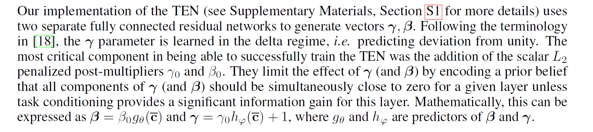 仔细看才看得懂.


**1)** 通过Auxiliary task co-training的训练方式训练feature extractor, 为support set和query set中的样例抽取特征得到class representation. 其中feature extractor中采用的是ResNet-12结构.

**2)** 借鉴Prototypical Network的思想, 将每类的样例得到的向量表示求平均得到每一类的原型, 随后使用类原型的平均值作为task representation, 将这个任务表示作为输入, 到TEN network中, 然后根据它的数据更新feature extractor提取的特征, 将任务特有的特征与样例提取的特征相结合, 使得support set和query set的class representation更具有泛化性.

**3)** 根据上一步的class representation计算similarity metric, 随后乘一个可学习的系数 $\alpha$ 来缩放距离度量, 增强模型的可适性. 最后将这步输出投入到softmax中得到图片的最终分类.

+ **理论方面证明的定理与推导过程?**
  + *Lemma 1*, Appendix A.
+ **这个任务/解决方法有什么意义?**
+ **对论文的讨论/感想?**


Meta-Learning with Differentiable Convex Optimization

### MetaOptNet

- [x] **MetaOptNet** (CVPR 2019) [[paperswithcode](https://paperswithcode.com/paper/meta-learning-with-differentiable-convex)]
    - Lee et al. "Meta-Learning with Differentiable Convex Optimization"


| 核心在哪? | 精读? 代码? | 关键词? | 亮点? | 笔记时间? |
| --------- | ----------- | ------- | ----- | --------- |
|           |             |         |       |           |

---

Our objective is to learn feature embeddings that generalize well under a linear classification rule for novel categories.


+ **背景? 提出了什么问题?**

+ **为了解决此问题提出了什么具体的idea?**

  使用线性分类器, 它能够规划为凸优化问题. 目标是二次规划QP, 这能够使用基于梯度的技巧进行有效解决获得全局最优解. 并且凸问题的解能够通过KKT条件刻画.

  由于后续需要计算任务期望, 基学习器必须是高效的, 并且为了估计嵌入模型 $f_{\phi}$ 的参数, 关于 $\phi$ 的梯度计算也必须是高效的, 这就鼓励选择简单的基学习器如最近类均值nearest-class-mean, 其参数 $\theta$ 是很容易计算的且目标函数是可微的.

  

+ **如何从该idea形式化地对问题建模、简化并解决的?**

+ **理论方面证明的定理与推导过程?**

+ **这个任务/解决方法有什么意义?**

+ **对论文的讨论/感想?**


### Survey

Bridging this gap between AI and humans is an important direction.


+ FSL定义:

  其中机器学习的定义为: 对于任务$T$, 从经验$E$中学习, 其中性能度量为$P$. 基于此, FSL经验$E$是有限的. given only a few labeled examples of each class.

+ 基本setting:

  Usually, one considers the $N$ -way- $K$ -shot classification [37,138], in which $D_{\text {train }}$ contains $I=K N$ examples from $N$ classes each with $K$ examples.

+ 应用场景:

  image classification [138], sentiment classification from short text [157] and object recognition [35], Few-shot regression [37, 156], few-shot reinforcement learning [3, 33].

+ 3 typical scenarios:

  + generate samples 并通过图灵测试.
  + Learning for rare cases.
  + Reducing data gathering effort and computational cost.

  

  总是和先验知识(which is "any information the learner has about the unknown function before seeing the examples")结合.

  `REMARK 1`: $E$ 中每类只有一个样本: one-shot learning, 同理zero-shot learning为不包含任何关于supervised information的样本, 但此时要求 $E$ 包含来自其他模式的信息(such as attributes, WordNet, and word embeddings used in rare object recognition tasks).

+ 相关的领域:

  Weakly supervised learning(Semi-supervised learning, Active learning); Imbalanced learning; Transfer learning; Meta-learning;


+ the **core issue** of FSL based on error decomposition.

  + Empirical Risk Minimization.
    $$
    \mathbb{E}\left[R\left(h_{I}\right)-R(\hat{h})\right]=\underbrace{\mathbb{E}\left[R\left(h^{*}\right)-R(\hat{h})\right]}_{\mathcal{E}_{\mathrm{app}}(\mathcal{H})}+\underbrace{\mathbb{E}\left[R\left(h_{I}\right)-R\left(h^{*}\right)\right]}_{\mathcal{E}_{\mathrm{est}}(\mathcal{H}, I)}
    $$
    the empirical risk minimizer $h_I$ 就是在优化: $\mathcal{E}_{\text {est }}(\mathcal{H}, I)$.

    但是在FSL中, $I$ (可利用的数据)很少, 会造成 $h_I$ 过拟合, 所以FSL任务的核心: **the empirical risk minimizer $h_I$ is no longer reliable.**

    如下图: 

    所以FSL任务需要利用先验知识, 现有工作可以分为: 

    + 基于数据: $\tilde{I} \gg I$, 让$h_I$变得更精确.
    + 基于模型: 使用先验知识约束 $\mathcal{H}$ 的复杂性, 此时$\mathcal{D}_{train}$可以学到好的$h_I$.
    + 基于算法: 改变 $h^*$ 的搜索策略

+ 基于数据增强的方法:

  以图像数据为例: translation [12, 76, 114, 119], flipping [103, 119], shearing [119], scaling [76, 160], reflection [34, 72], cropping [103, 160] and rotation [114, 138].

  依赖领域知识, 而且相应的变换得到的性能提升很大程度和数据集相关.

   

  

+ **论文说明, 按编号查找:**
  + [90] transformation procedure包含先验知识经验 $E$, 早期 FSL paper 从那些相似类中学习一系列的几何变换, 通过迭代地对齐样本.
  + [116] 从类似的类中学习了一组auto-encoders, 每一个都代表一个intra-class.
    variability. 向 $x_i$ 中添加学到的变量.
  + [53] 假设所有类别对于样本共享一些transformable variability, 学到一个transformation function.
  + [74] 使用independent attribute strength regressors去transform $x_i$.
  + [82] 在[72]基础上, 使用连续属性子空间为 $x_i$ 添加attribute variations.

**接下来3.2那页未看, data方法的.**


+ 基于Model的方法:

  希望ground-truth hypothesis $\hat{h}$ 和 $h^*$ 之间的距离越近.

  [92, 94] 可以只选择简单模型线性分类器.

  在FSL问题中, 最好有一个足够大的 $\mathcal{H}$, 这使得标准的机器学习模型变得不可行.

  所以该方法通过 $E$ 中的先验知识约束到一个更小的假设空间 $H \rightarrow \hat{H}$, 经验风险最小化变得可行.

  

  + **4.1 Multitask Learning**

    多任务学习[23,161]通过利用任务一般信息和任务特定信息来**同时**学习这些任务.

    $T_1, \cdots, T_C$, 有的任务数据量大, 有的少.

    用source task, 则few-shot task是target task.

    $D_{train}^c$ 是training set. 从中学习到每个任务 $T_c$ 对应的 $\theta_c$.

    两种方法: (i) parameter sharing; and (ii) parameter tying:

    + parameter sharing: 在任务之间共享参数.

      + [160] 共享前几层的一些信息, 学习不同的最后一层来处理不同的输出.

      + [61] nlp 任务, 先用同一个embedding, 再喂给 task-specific embedding functions and classifiers.
      + [95] a variational auto-encoder 从源任务进行预训练, 然后克隆到目标任务. 一些层是shared的, 同时允许两个任务都有一些task-specific的. 目标任务只能更新task-specific的, 而源任务可以同时更新shared和task-specific的层.
      + [12] 学习到一个task-specific space, 然后是一个共享的shared variational auto-encoder.

      之后跳过了基于data的方法.

  + **4.2 Embedding Learning**

    embedding到低维空间, 相似样本更接近, 在低维空间即更小的假设空间 $\mathcal{H}$, 这样更少的训练样本也能work;

    这里嵌入到低维空间的函数是从先验知识学到的, 当然也可能用了task-specific的信息.

    Embedding Learning的关键:

    + 测试样本也可以被映射到低维空间.
    + 相似度度量可以判断测试样本和训练样本在低维空间中表达的距离.

    [14, 138] 对测试样本和训练样本的embedding使用了不同的函数.

    

    + Task-Specific Embedding Model.

      通过只使用来自任务的信息来学习为每个任务定制嵌入函数.

      [130] 使用few-shot 数据集 $D_{train}^c$, 组成样本对, 并进行rank. 使用task-specific的信息学到embedding的函数.

    + Task-Invariant Embedding Model.

      从较大数据集中学到general的embedding function.

      

      历史脉络:

      + [36] 第一个FSL embedding模型, 使用kernel.
      + [70, 150] 使用convolutional siamese net[20].

      task-invariant embedding不使用 $D_{train}$ 更新embedding模型参数, 在训练集($N$类)中sample出$U$个类, 最大化模型在剩余 $N - U$ 个类上的性能.

      + [127] 学到了一个线性的embedding.

      通过mete-learning的方法学到的更加复杂:

      + [138] **Matching Nets.**

        [4, 8, 24] Matching Nets 的变体.

        + [4] residual LSTM (resLSTM) 更好的设计关于 训练集和测试集 的embedding函数.
        + [8] 加入了sample selection step, 将最有益的未标记样本标记出来, 并使用它来增强 $D_{train}$.
        + [24] 扩展到set-to-set的matching, 有效地对样本的多个部分进行标记.

      + [121] **Prototypical Network.**

        [100, 108, 141] ProtoNet 的变体.

        + [141] 将原型的思想嵌入到Matching Nets中.
        + [108] semi-supervised变体, 在学习过程中通过 soft-assignment 未标记样本来增强 $D_{train}$.

      + 其他方法:

        + [119] Attentive Recurrent Comparators (ARC), 使用带attention的LSTM来比较测试样例和原型. 将结果作为intermediate embedding.
        + [84, 115] 使用了GNN, leverage information from local neighborhoods.
        + [91] SNAIL, embedding network, 有着 interleaved temporal 的卷积层和attention层. 卷积层从过去的时间中汇集信息, 而注意力层则选择性地关注与当前输入相关的特定时间步长. (注意这些都是在某些特定任务下的).

    + Hybrid Embedding Model.

      task-invariant embedding methods 没有leverage关于当前任务的特定的知识. 所以Hybrid的方法就是: 利用 $D_{train}$ 中特定任务信息从先验知识中学习到的task-invariant嵌入模型. 就是下面 $f$ 所做的工作.

      

      + [14] Learnet, siamese net的改进, 将 $D_{train}$ 中的数据映射到 $f$ 的参数.
      + [13] 在Learnet的基础上改进成岭回归, 并得到参数的闭式解.

      [100, 162] 将 $D_{train}$ 看作一个整体来输出 $f$ 中的task-specific parameter.

      + [100] TADAM, Task dependent adaptive metric(TADAM) 将类原型平均到task embedding中, 并使用meta-learned函数将其映射到ProtoNet参数.
      + [162] Dynamic Conditional Convolutional Network (DCCN) 使用固定的一组filter, 使用$D_{train}$学到一组组合系数.

+ 4.3 Learning with External Memory

  [49, 89, 124, 145] 从 $D_{train}$ 中获取信息, 之后存储在memory中, $x_{test}$ 是由从外部memory的权重平均表示的, 这有一定的约束, 所以减小了假设空间 $\mathcal{H}$.

  

  + [89] key-value memory.
    $$
    M(i)=\left(M_{\mathrm{key}}(i), M_{\mathrm{value}}(i)\right)
    $$
    进来 $x_{test}$ 的时候, 通过相似度函数 $s\left(f\left(x_{\text {test }}\right), M_{\text {key }}(i)\right)$, 找slot, 输出 $\left(M_{\text {value }}(i)^{\prime} s\right)$.

    

    + Refining Representations:

      


## multi-agent reinforcement learning

> 在单智能体强化学习中，智能体所在的环境是稳定不变的，在多智能体系统中，每个智能体通过与环境进行交互获取奖励值来学习改善自己的策略，从而获得该环境下最优策略的过程被称为多智能体强化学习。
>
> 维度爆炸, 目标奖励确定困难, 不稳定性, 探索-利用.

通过**与环境的不断交互**来**学习每个状态的奖励值函数**, 再通过这些奖励值函数来学习得到最优纳什策略. 模型的转移概率以及奖励函数, 因此需要利用到Q-learning中的方法来不断**逼近状态值函数或动作-状态值函数.**

同步学习和演化问题. 收敛到均衡点是多智能体学习的基本要求. 现实难点: 状态 动作空间大, 博弈元素不完全可知.

 


**纳什均衡 (博弈的解)**


纳什均衡就是一个所有智能体的联结策略. 在纳什均衡处, 对于所有智能体而言都不能在仅改变自身策略的情况下, 来获得更大的奖励:
$$
V_{i}\left(\pi_{1}^{*}, \cdots, \pi_{i}^{*}, \cdots, \pi_{n}^{*}\right) \geq V_{i}\left(\pi_{1}^{*}, \cdots, \pi_{i}, \cdots, \pi_{n}^{*}\right), \forall \pi_{i} \in \Pi_{i}, i=1, \cdots, n
$$
还有其他的: 

纳什均衡下的协同博弈问题: 第二个斗车意思是个游戏, 胆小鬼先变道对方不变道的扣分.

**但是**, 这样在第一个"会车"情况下纳什均衡有两个解, 第二个"斗车"例子下有两个解而且有偏好. 所以我们就要修改一些基本设定, 比如 通信规则等.

合作博弈: $r_i$ 收益相等, 竞争博弈收益之和不变:


AI 博弈论方面, 不一定只关注Nash均衡:  

环境给予Agent一些State信息(可能是部分的), Agent做Action, 环境反馈给Agent一些Reward. Agent需要学习可以得到好Reward的Action.

监督学习 learning from teacher, 强化学习 learning from experience.

game over之后, 这段时期就叫一个episode.

+ reward decay: 某些action的reward是未来才能得到的, 长远打算.
+ exploration: 探索Agent没有做过的行为.

Policy-based: learn到一个Actor(做事的), Value-based: learn到一个Critic(判断者).

Action Function $\pi$: input observation.

+ Deep Learning: **步骤**

  1. action function.

     

  2. 判断这个function好不好.

     "类似"监督学习, 参数就是action函数的, 请注意这里的好坏反馈在episode过后, 得到的total reward.

     相同action function(参数一样下), episode过后的reward也是不一样的. 所以希望最大化 $r_{theta}$ (得到的reward)的期望值.

     + 定义 $\tau$ 代表某一个episode内的所有对象 状态 过程.

       但是选定某个Agent之后, 它的action会导致一类相似的 $\tau$.

       over 所有可能的 $\tau$, N场 N 个episode: $\tau^1 \cdots \tau^N$. 得到对 $\theta$ 下期望reward的近似.
       $$
       \bar{R}_{\theta}=\sum_{\tau} R(\tau) P(\tau \mid \theta)
       $$

  3. 选择最好的.

     最后还是用gradient descent.
     $$
     \begin{array}{l}
     \theta^{1} \leftarrow \theta^{0}+\eta \nabla \bar{R}_{\theta^{0}} \\
     \theta^{2} \leftarrow \theta^{1}+\eta \nabla \bar{R}_{\theta^{1}}
     \end{array}
     $$
     注意这里不需要知道 $R(\tau)$ 的具体形式, 得到是值是环境给的, 不需要知道形式.
     $$
     \nabla \bar{R}_{\theta}=\sum_{\tau} R(\tau) \nabla P(\tau \mid \theta)=\sum_{\tau} R(\tau) P(\tau \mid \theta) \frac{\nabla P(\tau \mid \theta)}{P(\tau \mid \theta)} = 
     $$
     

     

     

### Transformer

sequence to sequence model with attention.

+ self-attention: 与RNN一样, sequence到sequence的. 每一个layer可以考虑上层所有输入.


```python
# 注意这里的 _config
@ex.main
def my_main(_run, _config, _log):
    # ...
# 传到下面:
## run.py 里的这里开始进来:
## r_REGISTRY 在 runner/episode_runner.py 定义.
def run_sequential(args, logger):
    # Init runner so we can get env info
    runner = r_REGISTRY[args.runner](args=args, logger=logger)
    # ...

## 接下来进到 runner/episode_runner.py:

```


### DQN

- [x] **DQN** (19 Dec 2013) [[paperswithcode](https://paperswithcode.com/paper/playing-atari-with-deep-reinforcement)]
  - Mnih et al. "Playing Atari with Deep Reinforcement Learning"


| 核心在哪? | 精读? 代码? | 关键词? | 亮点? | 笔记时间? |
| --------- | ----------- | ------- | ----- | --------- |
|           |             |         |       |           |

---


+ **背景? 提出了什么问题?**
+ **为了解决此问题提出了什么具体的idea?**
+ **如何从该idea形式化地对问题建模、简化并解决的?**
+ **理论方面证明的定理与推导过程?**
+ **这个任务/解决方法有什么意义?**
+ **对论文的讨论/感想?**


### QMIX

- [x] **QMIX** (ICML 2018) [[paperswithcode](https://paperswithcode.com/paper/qmix-monotonic-value-function-factorisation)]
  - Rashid et al. "QMIX: Monotonic Value Function Factorisation for Deep Multi-Agent Reinforcement Learning"


| 核心在哪? | 精读? 代码? | 关键词? | 亮点? | 笔记时间? |
| --------- | ----------- | ------- | ----- | --------- |
|           |             |         |       |           |

---

探索了一种基于混合价值的多主体强化学习方法, 添加了约束和混合网络结构. 介于COMA和VDN之间.

QMIX使用了一个网络, 该网络**将单个代理值的复杂非线性组合作为联合动作值进行估计**, 而每个代理值仅根据本地观测得到.

+ **背景? 提出了什么问题?**

+ **为了解决此问题提出了什么具体的idea?**

  QMIX基于这样的观察: 下面贪心的假设可以推广到更大的单调函数族, 这些单调函数族对于满足上式也是充分的, 但不是必需的.
  $$
  \underset{\mathbf{u}}{\arg \max } Q_{t o t}=\left(\arg \max u^{1} Q 1 \cdots \arg \max u^{n} Q n\right)
  $$
  

  验证一个约束: **Global Action-Value function** and the **Action-Value function of each one of the agents,** in every action, avoiding factorization coming from VDN 之间的单调性.
  $$
  \frac{\partial Q_{t o t}}{\partial Q_{a}} \geq 0, \forall a
  $$
  允许每个agent通过选择针对其价值功能的贪婪动作来执行.

  只需要确保在$Q_{tot}$上执行的全局argmax与在每个$Q_a$上执行的单个argmax操作集产生相同的结果.

+ **如何从该idea形式化地对问题建模、简化并解决的?**

  

  + **agent 网络**

    represents its value function. 基于全局状态和联合动作的中心动作价值函数$Q_{tot}$.

    + input: observation, action.
    + return: Q action-value function.

    ```python
    import torch.nn as nn
    import torch.nn.functional as F
    class RNNAgent(nn.Module):
        def __init__(self, input_shape, args):
            super(RNNAgent, self).__init__()
            self.args = args
            self.fc1 = nn.Linear(input_shape, args.rnn_hidden_dim)
            self.rnn = nn.GRUCell(args.rnn_hidden_dim, args.rnn_hidden_dim)
            self.fc2 = nn.Linear(args.rnn_hidden_dim, args.n_actions)
    def init_hidden(self):
            # make hidden states on same device as model
            return self.fc1.weight.new(1, self.args.rnn_hidden_dim).zero_()
    ```

    

  + **Mixing 网络**:

    + input: $Q_a$ Action-Value functions.
    + output: the total Action-value function.

    注意如上大于零的约束: the weights are restricted to be non-negative. 网络结构图中红色的部分.

    ```python
    class QMixer(nn.Module):
        def __init__(self, args):
            super(QMixer, self).__init__()
             self.args = args
            self.n_agents = args.n_agents        
    self.state_dim = int(np.prod(args.state_shape))         self.embed_dim = args.mixing_embed_dim
             self.hyper_w_1 = nn.Linear(self.state_dim, self.embed_dim * self.n_agents)
            self.hyper_w_final = nn.Linear(self.state_dim, self.embed_dim)
             # State dependent bias for hidden layer        self.hyper_b_1 = nn.Linear(self.state_dim, self.embed_dim)
    # V(s) instead of a bias for the last layers
            self.V = nn.Sequential(nn.Linear(self.state_dim, self.embed_dim),
                                   nn.ReLU(),                               nn.Linear(self.embed_dim, 1))
    ```


+ **理论方面证明的定理与推导过程?**
+ **这个任务/解决方法有什么意义?**
+ **对论文的讨论/感想?**


## NLP

### Neural Model

- [x] **Neural Model** (conf) [[paperswithcode](https://paperswithcode.com/method/neural-probabilistic-language-model)]
    - Author et al. "A Neural Probabilistic Language Model"


| 核心在哪? | 精读? 代码? | 关键词? | 亮点? | 笔记时间? |
| --------- | ----------- | ------- | ----- | --------- |
|           |             |         |       |           |

---

+ train set: 一个词的序列: $w_1, \dots w_T$, $w_t \in T$是vocabulary中的一个词.
+ objective: $f\left(w_{t}, \cdots, w_{t-n+1}\right)=\hat{P}\left(w_{t} | w_{1}^{t-1}\right)$, 其中$w_i^j = (w_i, w_{i + 1}, \cdots, w_{j - 1}, w_j)$. 从这个意义上说, 它给出了high out-of-sample likelihood.
+ `perplexity`: $\frac{1}{\hat{P}\left(w_{t} | w_{1}^{t-1}\right)}$, the average negative log-likelihood的指数.
+ 模型的constraint:
  + $w_1^{t - 1}$的选择
  + $\sum_{i \in V} f (i, w_t, \cdots, w_{t - n + 1}) = 1$.
  + $f > 0$.
+ 通过这些条件概率的乘积, 得到单词序列的联合概率模型.

学习目标概率函数 通过两个步骤:

1. $C \in \mathbb{R}^{|V| \times m}$ 是词向量矩阵. $m$是词向量的维度.
2. $g$ 将输入序列 对应的词向量$(C(w_{t - n + 1}, \cdots , C(w_{t - 1}))$ 映射成 一个条件概率: $f (i, w_t, \cdots, w_{t - n + 1}) = g(i, (C(w_{t - n + 1}, \cdots , C(w_{t - 1})))$.

$f$ 是两个映射$C, \ g$的合成, $C$被context里面的所有word共享.

$C$的参数就是词向量自己(每个维度的值), 函数$g$可以由前馈或递归神经网络实现(也可以由另一个参数化函数实现), 参数为$w$. 总体参数集为$\theta = (C; \ w)$


free parameters的数量只与词汇量$V$成线性关系. 它也只与$n$阶成线性比例: 如果引入更多的共享结构, 比如使用延时神经网络或递归神经网络(或两者的组合), 比例因子可以减少到次线性. (???)


**network structure:**

+ two hidden layers:

  + the shared word feature layer $C$ (用$C$矩阵就类似一个word embedding, 也是**降维**), 非线性的.
  + the ordinary hyperbolic tangent hidden layer, `tanh`.

+ **softmax** output layer: 让正概率和为1.
  $$
  \hat{P}\left(w_{t} | w_{t-1}, \cdots w_{t-n+1}\right)=\frac{e^{y_{w_{t}}}}{\sum_{i} e^{y_{i}}}
  $$
  $y_i$是word i的 没有规范化的log-probabilities.

+ $y_i$: (**中间层** 隐含层, 下面的$x$代到这里) 词向量不仅被用作tanh的输入, 还被用作softmax层的输入
  $$
  y_i = b + W x + U \tanh (d + Hx)
  $$
  其中$x$输入word序列的vector:

+ $x$: (**输入层**, 生成词嵌入的表示)
  $$
  x = (C(w_{t - 1}, \cdots , C(w_{t - n + 1}))
  $$

+ $h$: 隐含层单元数量.

+ $m$: 词向量维度.

**(上面可以从下往上看)**

实际上 上面的 $Hx$还不是最终的矩阵形式, 因为$x$要变成$X$, 而且$x$的维度其实不是$(n - 1)$, 而是$(n - 1) \times m$. 因为它展成词向量的拼接了.

free parameters: (并不是超参数), $C$词向量矩阵也是学习得到的.
$$
b, \ d, \ U (\in \mathbb{R}^{|V| \times h}), \ H (\in \mathbb{R}^{h \times (n - 1)}), \ C \in \mathbb{R}^{|V| \times m}
$$
超参数大概是: $h, \ n - 1, \ m$. ($n - 1$可以变成$n - 2, n - 3$之类)

+ **背景? 提出了什么问题?**
+ **为了解决此问题提出了什么具体的idea?**
+ **如何从该idea形式化地对问题建模、简化并解决的?**
+ **理论方面证明的定理与推导过程?**
+ **这个任务/解决方法有什么意义?**
+ **对论文的讨论/感想?**


## `PlotNeuralNet`

```bash
git clone https://github.com/HarisIqbal88/PlotNeuralNet.git
# For Windows system, Type in the `git bash` interface:

```

