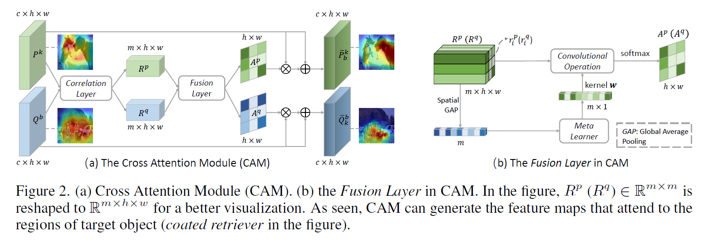

# Paper-Reading-Notes $(universal)$

[TOC]


```markdown
### MainTitle

- [x] (conf) [[paperswithcode]()]
    - Author et al. "Title"


| 核心在哪? | 精读? 代码? | 关键词? | 亮点? | 笔记时间? |
| --------- | ----------- | ------- | ----- | --------- |
|           |             |         |       |           |

---


+ **背景? 提出了什么问题?**
+ **为了解决此问题提出了什么具体的idea?**
+ **如何从该idea形式化地对问题建模、简化并解决的?**
+ **理论方面证明的定理与推导过程?**
+ **这个任务/解决方法有什么意义?**
+ **对论文的讨论/感想?**
```


### Adaptive Task Sampling (class-pair based)

- [x] **Adaptive Task Sampling (class-pair based)** (ECCV 2020) [[paperswithcode](https://paperswithcode.com/paper/adaptive-task-sampling-for-meta-learning)]
    - Liu et al. "Adaptive Task Sampling for Meta-Learning"


| 核心在哪? | 精读? 代码? | 关键词? | 亮点? | 笔记时间? |
| --------- | ----------- | ------- | ----- | --------- |
|           |             |         |       |           |

---


While a rich line of work focuses **solely on how to extract meta-knowledge across tasks**, we exploit the complementary problem on **how to generate informative tasks**.

We argue that the randomly sampled tasks could be **sub-optimal and uninformative** (e.g., the task of classifying “dog” from “laptop” is often trivial) to the meta-learner. In this paper, we propose **an adaptive task sampling method** to improve the generalization performance.


+ **背景? 提出了什么问题?**

  **an episodic training paradigm**.

  A series of few-shot tasks are sampled from meta-training data for **the extraction of transferable knowledge across tasks**, which is then applied to **new** few-shot classification tasks consisting of unseen classes during the meta-testing phase.

  + 问题的提出:

    Despite their noticeable improvements, these meta-learning approaches leverage **uniform sampling** over classes to generate few-shot tasks, which ignores the intrinsic relationships between classes when forming episodes.

    上述方法是 uniform sampling, 这忽略了forming episodes时候类之间的内在联系. 在一些领域中 比如集成学习Adaboost对challenging training examples优先训练后续分类器.

    + 很自然的**提出问题**: Can we perform adaptive task sampling and create more difficult tasks for meta-learning?

    + **难点**: one key challenge in task sampling is to define the difficulty of a task. 

  

  + **Review for Episodic Training:**

    1. In each episode of meta-training, we first **sample $K$ classes $\mathbb{L}^{K} \sim \mathbb{C}_{t r}$.**

    2. Then, we **sample $M$ and $N$ labelled images per class** in $\mathbb{L}^{K}$ to **construct** the support set $\mathbb{S}=\left\{\left(s_{m}, y_{m}\right)_{m}\right\}$ and query set $\mathbb{Q}=\left\{\left(q_{n}, y_{n}\right)_{n}\right\}$, respectively.

       从之前sample的类里面sample出 $\mathbb{S}, \mathbb{Q}$.

    3. The episodic training for few-shot learning **是在query set上最优**, The model is parameterized by $\theta$ and the loss is the negative loglikelihood of the true class of each query sample, 即优化:
       $$
       \ell(\theta)=\underset{(S, Q)}{\mathbb{E}}\left[-\sum_{\left(q_{n}, y_{n}\right) \in Q} \log p_{\theta}\left(y_{n} \mid q_{n}, S\right)\right]
       $$
       $p_{\theta}\left(y_{n} \mid q_{n}, S\right)$ 是在support set上的分类概率.

       注意啊上面的损失是**在 query set 上测的**, 但是训练(后验)是**在support上的.**

       梯度下降 $\Delta \ell(\theta)$.

    

  + **Review for Instance-base Adaptive Sampling for SGD:**

    **Select Sample 的概率:**

    + 第一次:
      $$
      p_{0}(i \mid \mathbb{D})=\frac{1}{|\mathbb{D}|}
      $$

    + 之后:

      instance $i$ at iteration $t+1$ **according to the current prediction probability $p\left(y_{i} \mid x_{i}\right)$** and the selection probability at previous iteration $p^{t}(i)$
      $$
      p^{t+1}(i) \propto\left(p^{t}(i)\right)^{\tau} e^{\alpha\left(1-p\left(y_{i} \mid x_{i}\right)\right)}
      $$
      where the hyperparameters $\tau$ is a discounting parameter and $\alpha$ scales the influence of current prediction.

      This multiplicative update method has a close relation to maximum loss minimization [47] and AdaBoost $[16]$.

+ **为了解决此问题提出了什么具体的idea?**

  a straightforward extension of the instance-based sampling.

+ **如何从该idea形式化地对问题建模、简化并解决的?**

  + **Class-based Sampling**:

    We propose a class-based sampling (c-sampling) approach that **updates the class selection probability $p_{C}^{t+1}(c)$ in each episode.**

    具体选择类概率的更新公式如下:

    Given $\mathbb{S}^{t}$ and $\mathbb{Q}^{t}$ at episode $t,$ we could update the class selection probability for each class in current episode $c \in \mathbb{L}_{K}^{t}$ in the following way,

    

    Note that we average the prediction probability of classifying each query sample $n$ into incorrect classes in $\mathbb{L}_{K}^{t} .$ Then we can sample $K$ classes without replacement to construct the category set $\mathbb{L}_{K}^{t+1}$ for the next episode.

    

    每个类的难度不是独立的.

    取出类别二元组, 无向概率图模型 马尔可夫随机场, 这里不是最大团.

    更新$C (i, j)$, 该类别对在上一次就混淆了, 接下来就要挑这个.

    不能接受的计算复杂度, 则使用贪心算法.

+ **理论方面证明的定理与推导过程?**

+ **这个任务/解决方法有什么意义?**

+ **对论文的讨论/感想?**


Stochastic optimization with importance sampling for regularized loss minimization. (ICML 2015)


> Diversity with Cooperation: Ensemble Methods for Few-Shot Classification
>
> Transferable Meta Learning Across Domains
>
> A Closer Look at Few-shot Classification
>
> Boosting Few-shot Image Recognition via Domain Alignment Prototypical Networks
>
> Cross-domain Few-shot Classification via Learned Feature-wise Transformation


### CloserLookFewShot

- [x]  (ICLR 2019) [[paperswithcode](https://paperswithcode.com/paper/a-closer-look-at-few-shot-classification-1)]
    - Chen et al. "A Closer Look at Few-shot Classification"


| 核心在哪? | 精读? 代码? | 关键词? | 亮点? | 笔记时间? |
| --------- | ----------- | ------- | ----- | --------- |
|           |             |         |       |           |

---


 

reducing intra-class variation 是重要的: when the feature backbone is shallow.

+ **背景? 提出了什么问题?**

  在一个更加公平的基础上来比较各个Few-Shot Learning算法之间的优劣.

  在研究 复现和实验现有算法过程中, 总结出的一份实验报告.

+ **为了解决此问题提出了什么具体的idea?**

  + 提出 consistent **comparative experiments** to compare several representative few-shot classification methods on common ground.

    在设置基类和新类的有限域差异时, 使用一个deep backbone可以缩小不同方法之间的性能差距.

  + 在distance-based classifier中替换线性分类器, 可以达到SotA.

  + 提出了一个practical evaluation setting. 其中存在基类和新类之间的领域转换.

+ **如何从该idea形式化地对问题建模、简化并解决的?**

  较多的base class的标记数据: $\mathbf{X}_{b}$, 较少的novel class标记数据 $\mathbf{X}_{n}$.

  在训练过程中 $\mathbf{X}_{n}$ 是unseen的.

  + 训练过程: 交叉熵损失 分类器 $C\left(. \mid \mathbf{W}_{b}\right)$ 由 $\mathbf{W}_{b}^{\top} f_{\theta}\left(\mathbf{x}_{i}\right)$ 的线性层, 然后是softmax函数.
  + Fine-tuning 过程: adapt 模型去识别新类, 固定feature extractor $f_\theta$ 的参数, 使用交叉熵损失训练一个新的分类器 $C\left(. \mid \mathbf{W}_{n}\right)$.

  **基于baseline的提升:**

  在训练时 explicitly reduces intra-class variation among features.

  

  

+ **理论方面证明的定理与推导过程?**

+ **这个任务/解决方法有什么意义?**

+ **对论文的讨论/感想?**


### MainTitle

- [ ]  (ICLR 2020) [[paperswithcode](https://paperswithcode.com/paper/cross-domain-few-shot-classification-via-1)]
  - Tseng et al. "Cross-Domain Few-Shot Classification via Learned Feature-Wise Transformation"


| 核心在哪? | 精读? 代码? | 关键词? | 亮点? | 笔记时间? |
| --------- | ----------- | ------- | ----- | --------- |
|           |             |         |       |           |

---


+ **背景? 提出了什么问题?**
+ **为了解决此问题提出了什么具体的idea?**
+ **如何从该idea形式化地对问题建模、简化并解决的?**
+ **理论方面证明的定理与推导过程?**
+ **这个任务/解决方法有什么意义?**
+ **对论文的讨论/感想?**


## About Attention/GNN

+ 近期:

  Attentive Graph Neural Networks for Few-Shot Learning

  Few-Shot Learning With Attention-Weighted Graph Convolutional Networks For Hyperspectral Image Classification

  

+ 相关:

  A Dual Attention Network with Semantic Embedding for Few-shot Learning

  **Multi-attention Meta Learning for Few-shot Fine-grained Image Recognition**

  **Attentive Weights Generation for Few Shot Learning via Information Maximization**

  

+ 高引:

  Dynamic Few-Shot Visual Learning Without Forgetting

  Few-Shot Learning with Graph Neural Networks

  TADAM

  **Cross Attention Network for Few-shot Classification**

  Few-Shot Semantic Segmentation with Prototype Learning


### FewShotWithoutForgetting

- [x] (CVPR 2018) [[paperswithcode](https://paperswithcode.com/paper/dynamic-few-shot-visual-learning-without)]
    - Gidaris et al. "Dynamic Few-Shot Visual Learning without Forgetting"


| 核心在哪? | 精读? 代码? | 关键词? | 亮点? | 笔记时间? |
| --------- | ----------- | ------- | ----- | --------- |
|           |             |         |       |           |

---

基于外部记忆的. base类和novel类之间是没有相同的. weight generator还把base weight作为输入. 先训练出feature extractor固定, 再训练后面的weight generator.

一般方法的不足/我们期望得到的.

+ 基类上的分类能力不能降, 新类上的学习要快, 效果要好.

+ ConvNet-based recognition model:
  $$
  p = C\left( F \left(x \mid \theta \right) \mid W_{b a s e} \right)
  $$

  + 令 $z = F \left(x \mid \theta \right)$, 我们有:
    $$
    p=\tau \cdot \cos \left(z, \ w\right)=\tau \cdot \bar{z}^{\top} \bar{w}
    $$

+ Few-shot classification weight generator:
  $$
  w^{\prime}=G\left(F \left(x^{\prime} \mid \theta \right), W_{b a s e} \mid \phi\right)
  $$

  + 如下, $\phi$ 都为learnable weight matrix; 分为$w_{a v g}^{\prime}, w_{a t t}^{\prime}, w^{\prime}$三个部分:
    $$
    \begin{aligned}
    w_{a v g}^{\prime}& = \frac{1}{N^{\prime}} \sum_{i=1}^{N^{\prime}} \bar{z}_{i}^{\prime} \\
    w_{a t t}^{\prime}& = \frac{1}{N^{\prime}} \sum_{i=1}^{N^{\prime}} \sum_{b=1}^{K_{b a s e}} A t t\left(\phi_{q} \bar{z}_{i}^{\prime}, k_{b}\right) \cdot \bar{w}_{b} \\
    w^{\prime} & =\phi_{a v g} \odot w_{a v g}^{\prime}+\phi_{a t t} \odot w_{a t t}^{\prime}
    \end{aligned}
    $$

+ 训练阶段 **1** 学习: $C$ 的 $\theta, \ W_{base}$.

  训练阶段 **2** 学习: 采样得fake novel class的$z$, (请注意 $W_{base}$ 蕴含在此), 喂给$G$学习参数 $\phi$, 训练得到的 $w'$ ($G$的输出)作为真正novel class的分类器参数.

注意力在注意啥? 代码中如何拆解为一般形式并理解?

+ **背景? 提出了什么问题?**

  需要做到:

  (a) the learning of the **novel categories needs to be fast**, 在新类上的学习要快.

  (b) to not **sacrifice** any recognition accuracy on **the initial categories** that the ConvNet was trained on, i.e., to not “forget” (from now on we will refer to those initial categories by calling them base categories). 原来的类上的性能不能降.

  not only is able to **recognize these base categories**, but also learns to **dynamically** recognize novel categories from only a few training examples (provided only at test time) while also not forgetting the base ones or requiring to be re-trained on them (dynamic few-shot learning without forgetting).

  不会忘记base class, 也不需要re-trained.

+ **为了解决此问题提出了什么具体的idea?**

  + **Few-shot classification-weight generator based on attention.**

    the first technical novelty of our work is that we enhance a typical object recognition system with an extra component, called **few-shot classification weight generator**:

    1. input: **a few training examples** of a novel category e.g., no more than five examples) and, 
    2. based on them, generates **a classification weight vector** for that novel category.

    + acquired **past knowledge** about the visual world:

      通过 incorporating an attention mechanism **over the classification weight vectors** of the base categories.

      注意力机制作用在base categories上.

    

  + **Cosine-similarity based ConvNet recognition model.**

    ConvNet 需要可以处理基类和新类的classification weight vectors.

    问题是: However, as we will explain in the methodology, this is **not** feasible with the **typical dot-product based classifier** (i.e., the last linear layer of a classification neural network). 

    implement the classifier as a **cosine similarity function** between **the feature representations and the classification weight vectors.**

    


+ **如何从该idea形式化地对问题建模、简化并解决的?**

  + **3.Methodology**

    base categories: $K_{base}$

    第 $b$ 类的训练样本数量: $N_b$, 第 $b$ 类的第 $i$ 个: $x_{b, i}$.

    

    接下来, 如上两个部分: a ConvNet-based recognition model that is able to recognize both base and novel categories, a few-shot classification weight generator: dynamically generates **classification weight vectors** for the novel categories at test time.

    + **a ConvNet-based recognition model**:

      feature extractor: $F(.\mid \theta), z=F(x \mid \theta) \in \mathbb{R}^{d}$.

      classifier: $C(.\mid W^*), p=C\left(z \mid W^{*}\right)$, **the probability classification scores $p$.**

      这个阶段学到了:

      + classification weight vectors: $W^*$
      + $\theta$

      

    + **Few-shot classification weight generator**:
      $$
      w_{n}^{\prime}=G\left(Z_{n}^{\prime}, W_{b a s e} \mid \phi\right)
      $$

  + **3.1.Cosine-similarity based recognition model**

    计算第$k$类的score:
    $$
    s_{k}=z^{\top} w_{k}^{*}
    $$
    请注意: However, **the mechanisms involved during learning those classification weights $w_k^*$ are very different.**

    + 对于base类的权值, 学习过程是缓慢的.
    + 对于novel类的权值, 学习是快速的, 因为基于输入特征.

    Due to those differences, the weight values in those two cases (i.e., base and novel classification weights) **can be completely different,** and so the same applies to the raw classification scores computed with the dot-product operation, which can **thus have totally different magnitudes** depending on whether they come **from the base or the novel categories.**

    base 类权重一样训练得到, novel 类的权重是weight generator的输出. 这样分类器就同时具备对基础类别和新类别进行分类的能力.

    因为这两种方式得到的权重有较大差异(**量级问题**), 传统的点积方法计算相似度会造成较大误差:

    所以修改 分类器$C(.\mid W^*)$为计算cos相似度:
    $$
    s_{k}=\tau \cdot \cos \left(z, w_{k}^{*}\right)=\tau \cdot \bar{z}^{\mathrm{T}} \bar{w}_{k}^{*}
    $$
    where $\bar{z}=\frac{z}{\|z\|}$ and $\bar{w}_{k}^{*}=\frac{w_{k}^{*}}{\left\|w_{k}^{*}\right\|}$ are the $l_{2}$ -normalized vectors (from now on we will use the overline symbol $\bar{z}$ to indicate that a vector $z$ is $l_{2}$ normalized , and $\tau$ is a learnable scalar value. 消除了基础类别权重和新类别权重在数值上的量级差异.

    

    **Advantages of cosine-similarity based classifier, 请再看原文, 作者为此还做了一个可视化.**

    

  + **3.2.Few-shot classification weight generator**

    $w^{\prime}=G\left(Z^{\prime}, W_{b a s e} \mid \phi\right)$ classification weight generator 的构建方式:

    **1 Feature averaging based ($\bar{z}_{i}^{\prime}$ 是特征向量)**
    $$
    w^{\prime}=\phi_{a v g} \odot w_{a v g}^{\prime} = \phi_{a v g} \odot \left(\frac{1}{N^{\prime}} \sum_{i=1}^{N^{\prime}} \bar{z}_{i}^{\prime} \right)
    $$
    **2 Attention-based**

    上述平均的方法不好, 特别是新类别只包含一个样本(one-shot情形)时不能充分利用特征提取网络的信息.
    $$
    w_{a t t}^{\prime}=\frac{1}{N^{\prime}} \sum_{i=1}^{N^{\prime}} \sum_{b=1}^{K_{b a s e}} A t t\left(\phi_{q} \bar{z}_{i}^{\prime}, k_{b}\right) \cdot \bar{w}_{b}
    $$

    $$
    w^{\prime}=\phi_{a v g} \odot w_{a v g}^{\prime}+\phi_{a t t} \odot w_{a t t}^{\prime}
    $$

    

+ **理论方面证明的定理与推导过程?**

+ **这个任务/解决方法有什么意义?**

+ **对论文的讨论/感想?**


### CAN

- [x] (NeurIPS 2019) [[paperswithcode](https://paperswithcode.com/paper/cross-attention-network-for-few-shot)]
    - Hou et al. "Cross Attention Network for Few-shot Classification"


| 核心在哪? | 精读? 代码? | 关键词? | 亮点? | 笔记时间? |
| --------- | ----------- | ------- | ----- | --------- |
|           |             |         |       |           |

---

we propose a novel Cross Attention Network to address the challenging problems in few-shot classification.

Firstly, Cross Attention Module is introduced to deal with the problem **of unseen classes**. The module generates **cross attention maps** for each pair of class feature and query sample feature so as to highlight the target object regions, making **the extracted feature more discriminative.** Secondly, a transductive inference algorithm is proposed to **alleviate the low-data problem**, which iteratively utilizes the unlabeled query set to augment the support set, thereby making the class features more representative.

+ **背景? 提出了什么问题?**

  难点(通用的):

  the test images in the support/query set are **from unseen classes, thus their features can hardly** attend to the target objects.

  

  the extracted features only capture the information of the objects that are **related to the training classes**.

  For another, the low-data problem makes the feature of each test class **not representative** for the true class distribution, as it is obtained from very few labeled support samples.

  **enhance the feature discriminability for few-shot classification.**

  To recognize a sample from unseen class given a few labeled samples, human tends to **firstly locate the most relevant** regions in the pair of labeled and unlabeled samples.

  **Transductive Algorithm 未看.**

+ **为了解决此问题提出了什么具体的idea?**

  

+ **如何从该idea形式化地对问题建模、简化并解决的?**

  metric-learning to obtain proper feature representations

  we propose Cross Attention Module (CAM): model **the semantic relevance between the class feature and query feature**, thus draw attention to the target objects and benefit the subsequent matching.

  

  $P^{k}$ 代表第$k$类的特征图, $Q^{b}$ 代表一个query样本的特征图.

  Correlation Layer 计算$P, Q$之间的correlation map. 对应点利用cos距离计算相关性.

  

+ **理论方面证明的定理与推导过程?**

+ **这个任务/解决方法有什么意义?**

+ **对论文的讨论/感想?**

  the episode training mechanism: The episodes used in training **simulate the settings in test**. the settings in test. Each episode is formed by **randomly sampling $C$ classes and $K$ labeled samples per class** as the support set $\mathcal{S}=\left\{\left(x_{a}^{s}, y_{a}^{s}\right)\right\}_{a=1}^{n_{s}}\left(n_{s}=C \times K\right),$ and a fraction of the rest samples from the $C$ classes as the query set $\mathcal{Q}=\left\{\left(x_{b}^{q}, y_{b}^{q}\right)\right\}_{b=1}^{n_{q}} .$ And we denote $\mathcal{S}^{k}$ as the support subset of the $k^{t h}$ class. **How to represent each support class $\mathcal{S}^{k}$ and query sample $x_{b}^{q}$ and measure the similarity between them** is a key issue for few-shot classification.

