# Paper-Reading-Notes

[TOC]


```markdown
### MainTitle

- [x] **MainTitle** (conf) [[paperswithcode]()]
    - Author et al. "Title"


| 核心在哪? | 精读? 代码? | 关键词? | 亮点? | 笔记时间? |
| --------- | ----------- | ------- | ----- | --------- |
|           |             |         |       |           |

---


+ **背景? 提出了什么问题?**
+ **为了解决此问题提出了什么具体的idea?**
+ **如何从该idea形式化地对问题建模、简化并解决的?**
+ **理论方面证明的定理与推导过程?**
+ **这个任务/解决方法有什么意义?**
+ **对论文的讨论/感想?**
```


## D1

出发点: 降低模型对样本的需要, 常规思路:

+ 引入正则化项, 降低模型的复杂度.
+ 考虑用其他方法简化模型.
+ 考虑数据的先验, 利用其他任务或者数据集本身的一些特性.

Meta-Learning, 在学习过程是学得一个好的embedding的思路, 从data学得一个 $\phi$, 数据点被映射到另一个特征空间.

1. Siamese Neural Network:

   训练方式为 生成pairs: $(x_i, x_j, y_{ij})$, 两幅图片 像/不像, 训练过程优化 $\| \phi(x_i) - \phi (x_j) \| _F^2$, 转化成距离的远近.

   缺点: 无法反映相似程度, 有些图片之间更相似/更不相似无法度量.

2. 由上缺点, 引入 triplet loss, $(x_i, x_j, x_k)$ 其中$x_i$和$x_j$之间相似, $x_i$和$x_k$之间不相似, $\min_{\phi} \mathcal{D_{ik}} - \mathcal{D}_{ij}$.

Multi-Task learning 视角:

两个数据集:

+ $(x_i^{(1)}, y_i^{(1)}) \sim \mathcal{D}_1$, $N_1$
+ $(x_i^{(2)}, y_i^{(2)}) \sim \mathcal{D}_2$, $N_2$

有点像第一个数据集是动物实拍图像, 第二个是动物标本图像, 两个数据集有相似的地方, 也有不相似的地方, 设计模型(两种极端情况):

1. 混合 $\mathcal{D}_1, \mathcal{D}_2$, 相当于参数全部共享.
2. 单独训练, 相当于参数全部分开.

设计模型的时候要考虑共享的训练参数, 也要考虑到不同的部分:
$$
\min_w \sum_{i = 1}^{N_i} \mathcal{L}_t \left(\Delta w_t (w^T x_i^{(t)}) \right)
$$
如上式, $w_t$就是不同数据集(任务)上不同的参数, $w$就是共有的部分.

具体的训练过程, 针对$\mathcal{T}$个Task就是:
$$
\min_\phi \frac{1}{T} \sum_{t = 1}^T \min_{w_t} \frac{1}{N_t} \mathcal{L} \left( w_t^T \phi(x_i^T)  \right)
$$
注意上式 $\phi$ 就相当于共享的参数, $w_t$ 就相当于独立的参数, 上式的训练过程就像Meta-Learning的训练过程(两层优化): 现在内层优化 $w_t$, 然后出来优化 $\phi$, 如此迭代循环.

**转化到Meta-Learning**, 就是要适应新的类, 就是之前没有见过的类也要会分类, 则为"省略共享的参数":
$$
\min_\phi \frac{1}{T} \sum_{t = 1}^T \frac{1}{N_Q^t} \sum_i^{N_Q^t} \mathcal{L} \left(\phi(x_i^{query}); \phi(x_i^{Support}))  \right)
$$


## Basic CNN Architectures

### AlexNet

- [x] **AlexNet** (NIPS 2012) [[paper](https://papers.nips.cc/paper/4824-imagenet-classification-with-deep-convolutional-neural-networks)] [[code (PyTorch)](https://github.com/dansuh17/alexnet-pytorch/blob/d0c1b1c52296ffcbecfbf5b17e1d1685b4ca6744/model.py#L40)]
    - Alex Krizhevsky et al. "ImageNet Classification with Deep Convolutional Neural Networks"

| 核心在哪?                            | 精读? 代码? | 关键词?                   | 亮点? | 阅读时间? |
| ------------------------------------ | ----------- | ------------------------- | ----- | --------- |
| Figure2(3.5节) & 防止过拟合技巧(4节) | 精读, 代码  | 大CNN, 基本处理过拟合技巧 |       | 2020-10-2 |

---

+ **提出了什么问题?**

  ImageNet 太大, 其目标检测任务是具有 the immense complexity 的.

+ **为了解决此问题提出了什么具体的idea?**

  利用先验知识, compensate 没有的数据. CNN 模型.

+ **如何从该idea形式化地对问题建模、简化并解决的?**

  + current GPUs, paired with a highly-optimized implementation of 2D convolution: 在ImageNet, 大CNN模型上训练, 并且大数据集可以防止过拟合.

    > Current GPUs are particularly well-suited to cross-GPU parallelization, as they are able to read from and write to one another’s memory directly, without going through host machine memory.

    

  + 输入:

    ImageNet 是 variable-resolution 的, 下采样到 `256 x 256`.

    

  + 网络结构:

    5层卷积, 3层全连接.

    激活函数: ReLU (non-saturating nonlinearity), 因为 tanh 之类的太慢.

    + Local Response Normalization (LRN):

      已被证明**并无实际作用**, 反而增加不少的计算量, **一般都不再使用**.

      激活的神经元抑制相邻的. ReLU 不需要输入归一化, 但是局部归一化有助于泛化性能, 对局部神经元创建了竞争的机制, 提高精度.

      kernel $i$ 在 $(x, y)$ 的激活值 归一化, $\sum$ 作用于 相邻的 映射在相同空间位置的kernel:
      $$
      b_{x, y}^{i}=a_{x, y}^{i} /\left(k+\alpha \sum_{j=\max (0, i-n / 2)}^{\min (N-1, i+n / 2)}\left(a_{x, y}^{j}\right)^{2}\right)^{\beta}
      $$

    + Overlapping Pooling:

      pooling unit 大小为 `z x z`, `stride < z, kernel_size=3, stride=2` 时为overlap的.

      这可以防止过拟合, 提升特征的丰富性.

    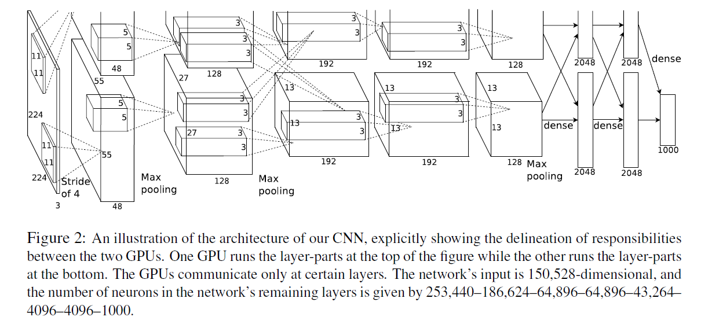

    

  + 减少过拟合:

    网络很大, 很容易过拟合.

    Data Augmentation:

    **1 label-preserving transformations:**

    裁切, 缩放, 翻转.

    > We do this by extracting random 224 x 224 patches (and their horizontal reflections) from the 256 x 256 images and training our network on these extracted patches4. This increases the size of our training set by a factor of 2048, though the resulting training examples are, of course, highly interdependent.

    **2 altering the intensities of the RGB channels:**

    > Specifically, we perform PCA on the set of RGB pixel values throughout the ImageNet training set. To each training image, we add multiples of the found principal components, with magnitudes proportional to the corresponding eigenvalues times a random variable drawn from a Gaussian with mean zero and standard deviation 0.1.

    即在每个通道上(RGB三个)增加:
    $$
    \left[\mathbf{p}_{1}, \mathbf{p}_{2}, \mathbf{p}_{3}\right]\left[\alpha_{1} \lambda_{1}, \alpha_{2} \lambda_{2}, \alpha_{3} \lambda_{3}\right]^{T}
    $$
    其中 $\mathbf{p}_{i}/\lambda_i$ 是特征向量/值, $\alpha_i$ 是高斯随机变量.

    **3 Dropout:**

    > setting to zero the output of each hidden neuron with probability 0.5.
    >
    > The neurons which are “dropped out” in this way **do not** contribute to the forward pass and do not participate in backpropagation.
    >
    > 所以不同时刻的输入是参与不同的 神经网络架构的. 但是这些不同架构共享参数. 一个神经元不能依赖于其他特定神经元的存在. 因此, 它被迫学习更健壮的特征, 这些特征在与其他神经元的许多不同随机子集结合时是有用的.

    

+ **理论方面证明的定理与推导过程?**

+ **这个任务/解决方法有什么意义?**

  **历史意义远大于模型影响.** 在此之后, 深度学习重新迎来春天.

  引爆了神经网络的应用热潮, 赢得了2012图像识别大赛的冠军. 使CNN成为在图像分类上的核心算法模型.

+ **对论文的讨论/感想?**

  要搞清楚 PyTorch 实现中各层参数维度. 卷积核个数/高/宽/深度.

  例子: `227 x 227 x 3` 的输入图像和卷积核 `11 x 11 x 3` 做卷积, 步长为4, 卷积后的尺寸是 `55 x 55 x 1`. 因为: (227 - 11 + 2 * 0) / 4 + 1 = 55.
  一共有96个卷积核, 最后的输出: 55 x 55 x 48 x 2. (图上之所以看起来是48个是由于2个GPU服务器处理, 每个服务器承担了48个): 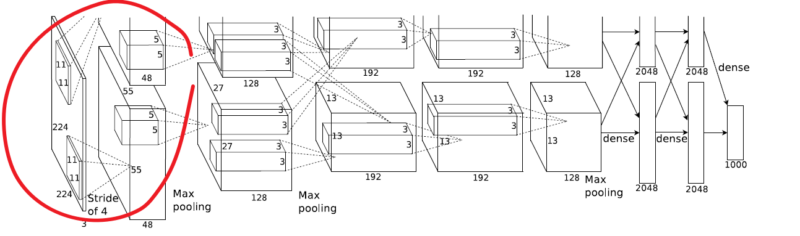


**GoogLeNet**, a.k.a **Inception v.1** (2014) [[paper](https://arxiv.org/abs/1409.4842)]

- Szegedy et al. "Going Deeper with Convolutions" [Google]
- Original [LeNet page](http://yann.lecun.com/exdb/lenet/) from Yann LeCun's homepage.
-  **Inception v.2 and v.3** (2015) Szegedy et al. "Rethinking the Inception Architecture for Computer Vision" [[paper](https://arxiv.org/abs/1512.00567)]
-  **Inception v.4 and InceptionResNet** (2016) Szegedy et al. "Inception-v4, Inception-ResNet and the Impact of Residual Connections on Learning" [[paper](https://arxiv.org/abs/1602.07261)]
- "A Simple Guide to the Versions of the Inception Network" [[blogpost](https://towardsdatascience.com/a-simple-guide-to-the-versions-of-the-inception-network-7fc52b863202)]


### VGG

- [x] **VGG** (2014) [[paperswithcode](https://paperswithcode.com/method/vgg)]
    + **Simonyan et al. "Very Deep Convolutional Networks for Large-Scale Image Recognition" (2014) [Google DeepMind & Oxford's Visual Geometry Group (VGG)] [[paper](https://arxiv.org/abs/1409.1556)]**
    + *VGG-16*: Zhang et al. "Accelerating Very Deep Convolutional Networks for Classification and Detection" [[paper](https://arxiv.org/abs/1505.06798?context=cs)]


| 核心在哪? | 精读? 代码? | 关键词? | 亮点? | 笔记时间? |
| --------- | ----------- | ------- | ----- | --------- |
|           |             |         |       |           |

---


+ **背景? 提出了什么问题?**
+ **为了解决此问题提出了什么具体的idea?**
+ **如何从该idea形式化地对问题建模、简化并解决的?**
+ **理论方面证明的定理与推导过程?**
+ **这个任务/解决方法有什么意义?**
+ **对论文的讨论/感想?**


### GoogLeNet

- [x] **MainTitle** (CVPR 2015) [[paperswithcode](https://paperswithcode.com/method/googlenet)]
    - **Szegedy et al. "Going Deeper with Convolutions" [Google]**
    - Original [LeNet page](http://yann.lecun.com/exdb/lenet/) from Yann LeCun's homepage.
    - **Inception v.2 and v.3** (2015) Szegedy et al. "Rethinking the Inception Architecture for Computer Vision" [[paper](https://arxiv.org/abs/1512.00567)]
    - **Inception v.4 and InceptionResNet** (2016) Szegedy et al. "Inception-v4, Inception-ResNet and the Impact of Residual Connections on Learning" [[paper](https://arxiv.org/abs/1602.07261)]
    - "A Simple Guide to the Versions of the Inception Network" [[blogpost](https://towardsdatascience.com/a-simple-guide-to-the-versions-of-the-inception-network-7fc52b863202)]


| 核心在哪? | 精读? 代码? | 关键词? | 亮点? | 笔记时间? |
| --------- | ----------- | ------- | ----- | --------- |
|           |             |         |       |           |

---


+ **背景? 提出了什么问题?**
+ **为了解决此问题提出了什么具体的idea?**
+ **如何从该idea形式化地对问题建模、简化并解决的?**
+ **理论方面证明的定理与推导过程?**
+ **这个任务/解决方法有什么意义?**
+ **对论文的讨论/感想?**


### ResNet

- [x] **ResNet** (CVPR 2016) [[paperswithcode](https://paperswithcode.com/paper/deep-residual-learning-for-image-recognition) ([ResNet Explained](https://paperswithcode.com/method/resnet))]
    - He et al. "Deep Residual Learning for Image Recognition"


| 核心在哪? | 精读? 代码? | 关键词? | 亮点? | 笔记时间? |
| --------- | ----------- | ------- | ----- | --------- |
|           | 精读, 代码  |         |       |           |

---


+ **背景? 提出了什么问题?**
+ **为了解决此问题提出了什么具体的idea?**
+ **如何从该idea形式化地对问题建模、简化并解决的?**
+ **理论方面证明的定理与推导过程?**
+ **这个任务/解决方法有什么意义?**
+ **对论文的讨论/感想?**


## Meta Learning

如何才能让模型仅用少量的数据学习? 
我们期望好的meta learning模型能够具备**强大的适应能力和泛化能力**. 在测试时, 模型会先经过一个自适应环节（adaptation process）, 即根据少量样本学习任务. 自适应本质上来说就是一个短暂的学习过程.

最佳的meta learning模型参数可以表示为:
$$
\theta^{*}=\arg \min _{\theta} \mathbb{E}_{\mathcal{D} \sim p(\mathcal{D})}\left[\mathcal{L}_{\theta}(\mathcal{D})\right]
$$
上式中的每个*数据集*是一个*数据样本*. Few-shot Learning中数据集 $\mathcal{D}$ 被分为 support set/query set.

Training Set 是 Support Set, Test Set 是 Query Set.

+ $\star$ N-ways K-shot classification:

  在 Training 和 Test Tasks 里, 有 N 个类别, 每个类别有 K 个用例.


### Siamese Network

- [x] **Siamese Network** (ICML 2015) [[paper](https://www.cs.cmu.edu/~rsalakhu/papers/oneshot1.pdf)] [[code (keras)](https://github.com/tensorfreitas/Siamese-Networks-for-One-Shot-Learning)]
    - Gregory Koch et al. "Siamese Neural Networks for One-shot Image Recognition"


| 核心在哪?   | 精读? 代码? | 关键词? | 亮点? | 阅读时间? |
| ----------- | ----------- | ------- | ----- | --------- |
| Model 3.1节 | 精读        |         |       | 2020-10-2 |

---

+ **提出了什么问题?**

+ **为了解决此问题提出了什么具体的idea?**

  

+ **如何从该idea形式化地对问题建模、简化并解决的?**

  + **Model:**
    $$
    \begin{aligned}
    a_{1, m}^{(k)} &=\text{max-pool}\left(\max \left(0, \mathbf{W}_{l-1, l}^{(k)} \star \mathbf{h}_{1,(l-1)}+\mathbf{b}_{l}\right), 2\right) \\
    a_{2, m}^{(k)} &=\text{max-pool}\left(\max \left(0, \mathbf{W}_{l-1, l}^{(k)} \star \mathbf{h}_{2,(l-1)}+\mathbf{b}_{l}\right), 2\right)
    \end{aligned}
    $$
    共享参数.

    **预测(输出层):**
    $$
    \mathbf{p} = \sigma\left(\sum_{j} \alpha_{j}\left|\mathbf{h}_{1, L-1}^{(j)}-\mathbf{h}_{2, L-1}^{(j)}\right|\right)
    $$
    请注意**最关键**就在上述式子, $x$ embedding之后比较距离, 接softmax转换成概率.

    > This final layer induces a metric on the **learned** feature space of the (L - 1)th hidden layer and **scores** the similarity between the two feature vectors.

    **loss function:**
    $$
    \begin{array}{c}
    \mathcal{L}\left(x_{1}^{(i)}, x_{2}^{(i)}\right)=\mathbf{y}\left(x_{1}^{(i)}, x_{2}^{(i)}\right) \log \mathbf{p}\left(x_{1}^{(i)}, x_{2}^{(i)}\right)+ \\
    \left(1-\mathbf{y}\left(x_{1}^{(i)}, x_{2}^{(i)}\right)\right) \log \left(1-\mathbf{p}\left(x_{1}^{(i)}, x_{2}^{(i)}\right)\right)+\boldsymbol{\lambda}^{T}|\mathbf{w}|^{2}
    \end{array}
    $$
    正类: 两个同一个类, 相似, 即 $\mathbf{y}\left(x_{1}^{(i)}, x_{2}^{(i)}\right) = 1$, 反之等于0.

    

    **Optimization:**
    $$
    \begin{array}{c}
    \mathbf{w}_{k j}^{(T)}\left(x_{1}^{(i)}, x_{2}^{(i)}\right)=\mathbf{w}_{k j}^{(T)}+\Delta \mathbf{w}_{k j}^{(T)}\left(x_{1}^{(i)}, x_{2}^{(i)}\right)+2 \lambda_{j}\left|\mathbf{w}_{k j}\right| \\
    \Delta \mathbf{w}_{k j}^{(T)}\left(x_{1}^{(i)}, x_{2}^{(i)}\right)=-\eta_{j} \nabla w_{k j}^{(T)}+\mu_{j} \Delta \mathbf{w}_{k j}^{(T-1)}
    \end{array}
    $$

    > the gradient is additive **across the twin networks** due to the tied weights.

    > **learning rates** were decayed uniformly across the network by 1 percent per epoch, so that $\eta_{j}^{(T)}=0.99 \eta_{j}^{(T-1)}$.

    > We used the beta version of Whetlab, a Bayesian optimization framework, to perform **hyperparameter selection**.

    **Weight initialization:**

    卷积层: $\mathcal{N}(0, 10^{-2})$, bias: $\mathcal{N}(0.5, 10^{-2})$.

    **Affine distortions:**
    $$
    \mathrm{x}_{1}^{\prime}=T_{1}\left(\mathrm{x}_{1}\right), \mathrm{x}_{2}^{\prime}=T_{2}\left(\mathrm{x}_{2}\right)
    $$
    其中$T_i$是 multidimensional uniform distribution 中随机选取的.

    

+ **理论方面证明的定理与推导过程?**

+ **这个任务/解决方法有什么意义?**

  假设: 学到的 embedding 在未见过的分类上依然能很好的衡量图片间的距离, 这与迁移学习中是一致的.

  > a) are capable of **learning generic image features** useful for making predictions about unknown class distributions even when very few examples from these **new distributions are available**;
  >
  > b) are easily trained **using standard optimization techniques** on pairs sampled from the source data;
  >
  > c) provide a competitive approach that **does not rely** upon **domain-specific** knowledge by instead exploiting deep learning techniques.

  

+ **对论文的讨论/感想?**

  关注Siamese的不足在哪, 似乎没有考虑其他训练集数据的影响, 就只是与单一对的0/1比较? 对比matching和Prototypical.


### Matching Networks

- [x] **Matching Networks** (NIPS 2016) [[paper](https://arxiv.org/abs/1606.04080)] [[code (PyTorch)](https://github.com/oscarknagg/few-shot/blob/master/few_shot/matching.py)]
    - Oriol Vinyals et al. "Matching Networks for One Shot Learning"


| 核心在哪?              | 精读? 代码? | 关键词? | 亮点? | 阅读时间? |
| ---------------------- | ----------- | ------- | ----- | --------- |
| 2.1.1, 2.1.2, Appendix | 精读        |         |       | 2020-10-2 |

---

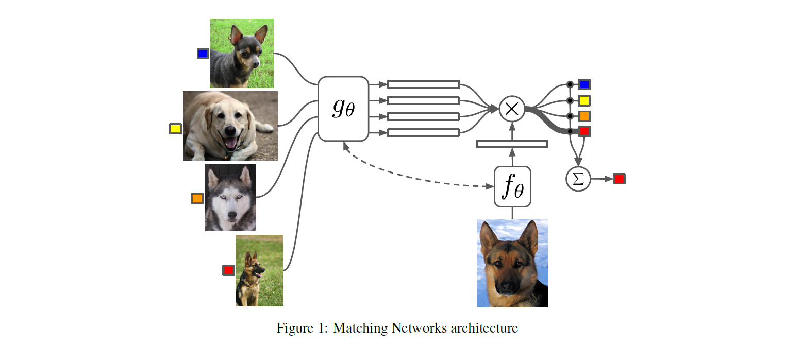

+ **背景? 提出了什么问题?**

  > a neural attention mechanism, often fully differentiable, is defined to access (or read) a memory matrix which stores useful information to solve the task at hand.

  

+ **为了解决此问题提出了什么具体的idea?**

  > cast the problem of one-shot learning within the set-to-set framework

  > reinterpreting a well studied framework (neural networks with external memories) to do one-shot learning.

  分到某个类的权重由在 support set 中一系列label的加权和, **权重由一个注意力核** (attention kernel) $a(\mathbf{x}, \mathbf{x}_i)$ 决定.

  权重应当与 $\mathbf{x}_i$ 和 $\mathbf{x}_i$ 间的相似度成正比.

+ **如何从该idea形式化地对问题建模、简化并解决的?**
  $$
  \hat{y}=\sum_{i=1}^{k} a\left(\hat{x}, x_{i}\right) y_{i}
  $$
  Attention kernel由两个embedding function $f$ 和 $g$ 决定.

  分别用于encoding测试样例和支持集样本. 两个样本之间的注意力权重是经过softmax归一化后的, embedding vectors之间cosine距离 $\operatorname{cosine}( \cdot)$.
  $$
  a\left(\mathbf{x}, \mathbf{x}_{i}\right)=\frac{\exp \left(\operatorname{cosine}\left(f(\mathbf{x}), g\left(\mathbf{x}_{i}\right)\right)\right.}{\sum_{j=1}^{k} \exp \left(\operatorname{cosine}\left(f(\mathbf{x}), g\left(\mathbf{x}_{j}\right)\right)\right.}
  $$
  
  

  + **Full Context Embeddings**:
  
    **只把一个数据样本作为embedding function的输入, 会导致很难高效的估计出整个特征空间.**
  
    通过把整个支持集 $S$ 作为embedding function的额外输入来加强embedding的有效性, 相当于给样本**添加了语境**, 让embedding根据样本与支持集中**样本的关系进行调整.**
  
    以下看Appendix:
  
    $g_{\theta}\left(\mathbf{x}_{i}, S\right)$ 在整个支持集 $S$ 的语境下用一个双向LSTM来编码 $\mathbf{x}_{i}$
    $f_{\theta}(\mathbf{x}, S)$ 在支持集 $S$ 上使用read attention机制编码测试样本 $\mathbf{x}$
  
    1. 首先测试样本经过一个简单的神经网络, 比如CNN以抽取基本特征 $f^{\prime}(\mathbf{x})$.
    2. 然后, 一个**带有read attention vector的LSTM**被训练用于生成部分hidden state:
    $$
    \begin{aligned}
    \hat{\mathbf{h}}_{t}, \mathbf{c}_{t} &=\operatorname{LSTM}\left(f^{\prime}(\mathbf{x}),\left[\mathbf{h}_{t-1}, \mathbf{r}_{t-1}\right], \mathbf{c}_{t-1}\right) \\
    \mathbf{h}_{t} &=\hat{\mathbf{h}}_{t}+f^{\prime}(\mathbf{x}) \\
    \mathbf{r}_{t-1} &=\sum_{i=1}^{k} a\left(\mathbf{h}_{t-1}, g\left(\mathbf{x}_{i}\right)\right) g\left(\mathbf{x}_{i}\right) \\
    a\left(\mathbf{h}_{t-1}, g\left(\mathbf{x}_{i}\right)\right) &=\operatorname{softmax}\left(\mathbf{h}_{t-1}^{\top} g\left(\mathbf{x}_{i}\right)\right)=\frac{\exp \left(\mathbf{h}_{t-1}^{\top} g\left(\mathbf{x}_{i}\right)\right)}{\sum_{j=1}^{k} \exp \left(\mathbf{h}_{t-1}^{\top} g\left(\mathbf{x}_{j}\right)\right)}
    \end{aligned}
    $$
    3. 最终, 如果我们做k步的读取 $f(\mathbf{x}, S)=\mathbf{h}_{K}$.
  
    这类方法对于困难的任务 (few-shot classification on mini ImageNet) 有所帮助.
  
+ **理论方面证明的定理与推导过程?**

  > We propose embedding the elements of the set through a function which takes as input the full set $S$ in addition to $x_{i},$ i.e. $g$ becomes $g\left(x_{i}, S\right) .$ Thus, as a function of the whole support set $S, g$ can modify how to embed $x_{i} .$ This could be useful when some element $x_{j}$ is very close to $x_{i},$ in which case it may be beneficial to change the function with which we embed $x_{i}-$ some evidence of this is discussed **in Section 4** . We use a bidirectional Long-Short Term Memory (LSTM) [8] to encode $x_{i}$ in the context of the support set $S,$ considered as a sequence (**see appendix** for a more precise definition).

  

+ **这个任务/解决方法有什么意义?**

+ **对论文的讨论/感想?**


### Prototypical Networks

- [x] **Prototypical Networks** (NIPS 2017) [[paper](https://arxiv.org/abs/1703.05175)] [[code](https://github.com/jakesnell/prototypical-networks)]
  - Snell et al. "Prototypical Networks for Few-shot Learning"

| 核心在哪?   | 精读? 代码? | 关键词?               | 亮点?    | 笔记时间? |
| ----------- | ----------- | --------------------- | -------- | --------- |
| Model 2.2节 | 精读        | Prototypical Networks | 新的网络 | 2020-10-2 |

---

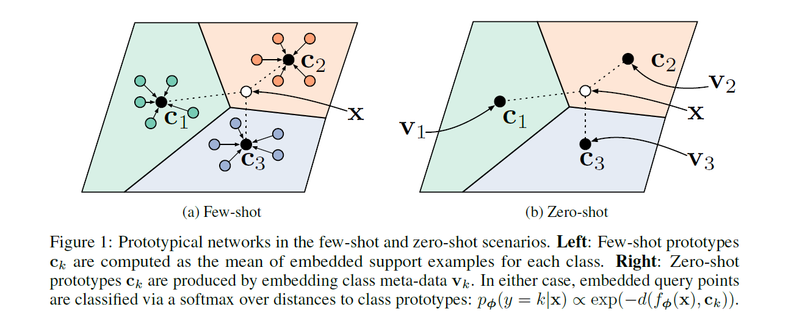

+ **提出了什么问题?**

+ **为了解决此问题提出了什么具体的idea?**

  对于meta-data, 学到它们的embedding (non-linear mapping), 在shared space构建每个类的prototype. 对于query set的, 先embedding, 再找最相邻的prototype.


+ **如何从该idea形式化地对问题建模、简化并解决的?**

  + **Model:**

    **embedding function** $f_{\phi}: \mathbb{R}^D \rightarrow \mathbb{R}^M$, 参数 $\phi$. prototype $\mathbf{c}_{k}$ 是 support set 里面数据的embedding后均值:
    $$
    \mathbf{c}_{k}=\frac{1}{\left|S_{k}\right|} \sum_{\left(\mathbf{x}_{i}, y_{i}\right) \in S_{k}} f_{\boldsymbol{\phi}}\left(\mathbf{x}_{i}\right)
    $$
    对于每个query point $x$, 基于"距离"原型网络建立了该点到 每个原型$\mathbf{c}_{k}$的概率分布:
    $$
    p_{\boldsymbol{\phi}}(y=k \mid \mathbf{x})=\frac{\exp \left(-d\left(f_{\boldsymbol{\phi}}(\mathbf{x}), \mathbf{c}_{k}\right)\right)}{\sum_{k^{\prime}} \exp \left(-d\left(f_{\boldsymbol{\phi}}(\mathbf{x}), \mathbf{c}_{k^{\prime}}\right)\right)}
    $$

  + **学习过程:**

    通过SGD最小化负对数概率 (到每个原型的): $J(\boldsymbol{\phi})=-\log p_{\boldsymbol{\phi}}(y=k \mid \mathbf{x})$

    

    **training episode**是training set的随机选取的子集, 在每个类中选择一些作为support set, 其余是query set. 结合episodes和mini-batch的思路模拟测试场景进行训练.

    伪代码:

    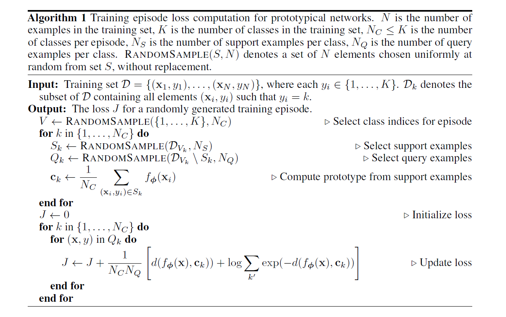

    

  + 学习过程是 Mixture Density Estimation:

    使用[Bregman散度](https://www.zhihu.com/question/22426561/answer/209945856), 相当于在support set上用指数族 混合密度估计. Bregman定义如下:
    $$
    d_{\varphi}\left(\mathbf{z}, \mathbf{z}^{\prime}\right)=\varphi(\mathbf{z})-\varphi\left(\mathbf{z}^{\prime}\right)-\left(\mathbf{z}-\mathbf{z}^{\prime}\right)^{T} \nabla \varphi\left(\mathbf{z}^{\prime}\right)
    $$
    where $\varphi$ is a differentiable, strictly convex function of the Legendre type.

    注意Bregman散度 通过改变$\varphi$ 可以生成不同的距离度量: 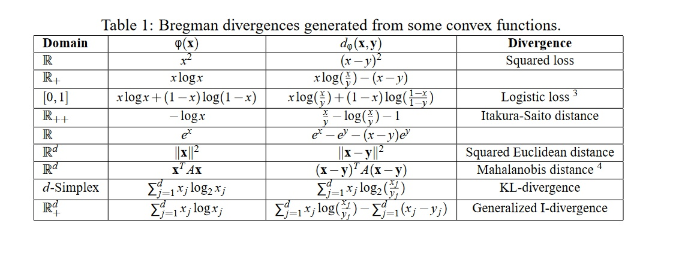

    为什么选择均值作为 prototype:
    It has been shown [4] for Bregman divergences that the cluster representative achieving minimal distance to its assigned points is the cluster mean.

    下面似乎是直接写出了混合密度估计中后验的表达式(指数族混合模型), 关于Bregman散度: 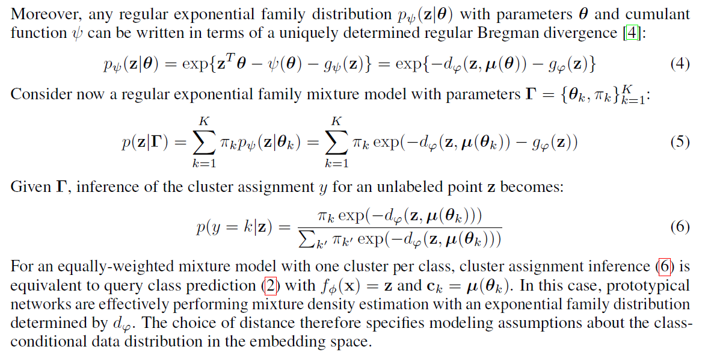

    

  + 作为线性模型的解释:
    $$
    -\left\|f_{\phi}(x)-c_{k}\right\|^{2}=-f_{\phi}(x)^{T} f_{\phi}(x)+2 c_{k}^{T} f_{\phi}(x)-c_{k}^{T} c_{k}
    $$
    RHS 第一项不变, 所以后面对应线性模型有:
    $$
    2 c_{k}^{T} f_{\phi}(x)-c_{k}^{T} c_{k}=w_{k}^{T} f_{\phi}(x)+b_{k}, \text { 其中 } w_{k}=2 c_{k}, b_{k}=-c_{k}^{T} c_{k}
    $$
    这个假设是基于: all of the required non-linearity can be learned within the embedding function.

  

+ **理论方面证明的定理与推导过程?**

  [4] Arindam Banerjee, Srujana Merugu, Inderjit S Dhillon, and Joydeep Ghosh. Clustering with bregman divergences. Journal of machine learning research, 6(Oct):1705–1749, 2005.

  

+ **这个任务/解决方法有什么意义?**

+ **对论文的讨论/感想?**

  注意考虑模型和其他之间的关联(比如上面和混合密度估计/线性模型).

  学习过程的细节? $\mathbf{c}_k$ 是不断变化的.


### Relation Network

- [x] **Relation Network** (CVPR 2018) [[paper](https://openaccess.thecvf.com/content_cvpr_2018/papers_backup/Sung_Learning_to_Compare_CVPR_2018_paper.pdf)] [[code (PyTorch)](https://github.com/floodsung/LearningToCompare_FSL)]
    - Sung et al. "Learning to Compare: Relation Network for Few-Shot Learning"


| 核心在哪?                          | 精读? 代码? | 关键词? | 亮点? | 阅读时间? |
| ---------------------------------- | ----------- | ------- | ----- | --------- |
| 3.2 Model 3.4 Network Architecture | 精读        |         |       | 2020-10-3 |

---

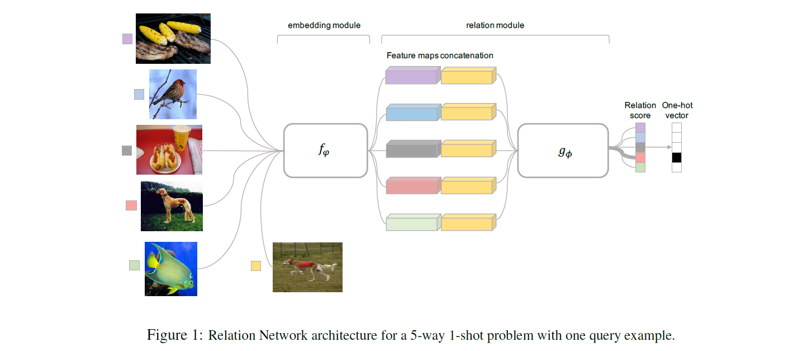 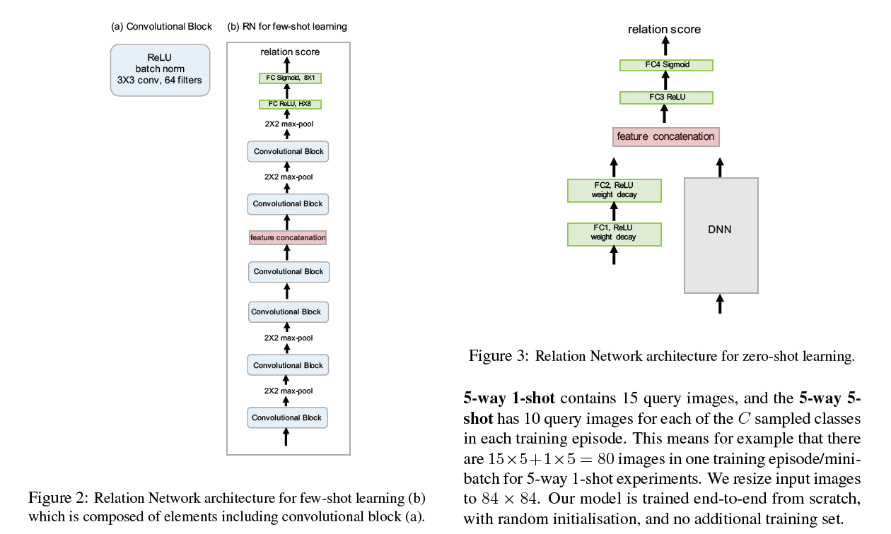

+ **背景? 提出了什么问题?**

  

+ **为了解决此问题提出了什么具体的idea?**

  > As most few-shot learning models utilize four convolutional blocks for embedding module [39, 36], we follow the same architecture setting for fair comparison, see Figure 2.

  > More concretely, each convolutional block contains a 64-
  > filter `3 x 3` convolution, a batch normalization and a ReLU nonlinearity layer respectively. The first two blocks also contain a `2 x 2` max-pooling layer while the latter two do not.

  

+ **如何从该idea形式化地对问题建模、简化并解决的?**

  + **Model:** (Figure 1)

    **1 an embedding module $f_\varphi$:**

    feature maps & combine(a concatenation):
    $$
    \mathcal{C}\left(f_{\varphi}\left(x_{i}\right), f_{\varphi}\left(x_{j}\right)\right)
    $$
    

    **2 a relation module $g_\varphi$:**

    生成 relation score: $\in [0, 1]$ **representing the similarity** between $x_i$ and $x_j$:
    $$
    r_{i, j}=g_{\phi}\left(\mathcal{C}\left(f_{\varphi}\left(x_{i}\right), f_{\varphi}\left(x_{j}\right)\right)\right), \quad i=1,2, \ldots, C
    $$
  
+ 损失函数:
  
  目标优化函数是MSE损失, 而不是cross-entropy, 因为RN在预测时更倾向于把相似系数预测过程**作为一个regression问题**, 而不是二分类问题.
  $$
    \varphi, \phi \leftarrow \underset{\varphi, \phi}{\operatorname{argmin}} \sum_{i=1}^{m} \sum_{j=1}^{n}\left(r_{i, j}-1\left(y_{i}==y_{j}\right)\right)^{2}
  $$

+ **理论方面证明的定理与推导过程?**
+ **这个任务/解决方法有什么意义?**
+ **对论文的讨论/感想?**


### MAML

- [x] **MAML** (ICML 2017) [[paper](http://proceedings.mlr.press/v70/finn17a/finn17a.pdf)] [[code (原)](https://github.com/cbfinn/maml) [code(PyTorch)](https://github.com/dragen1860/MAML-Pytorch)]
    - Finn et al. "Model-Agnostic Meta-Learning for Fast Adaptation of Deep Networks"


| 核心在哪? | 精读? 代码? | 关键词? | 亮点? | 笔记时间? |
| --------- | ----------- | ------- | ----- | --------- |
|           | 精读        |         |       |           |

---

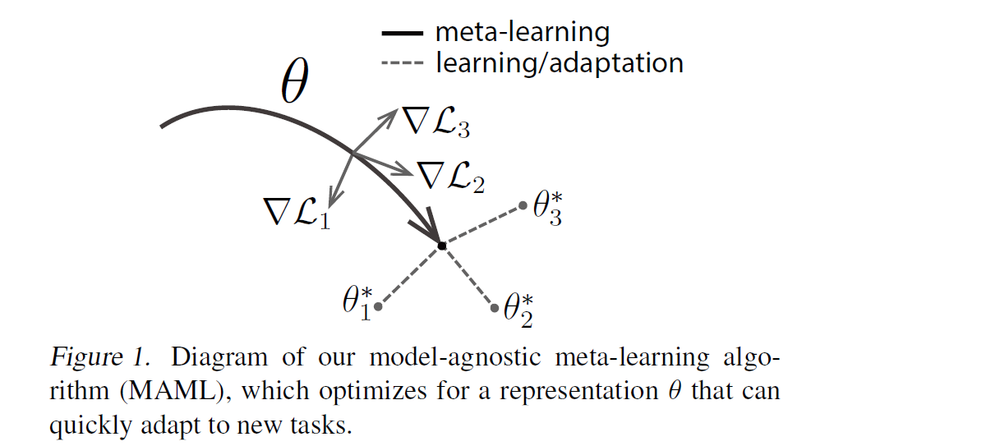 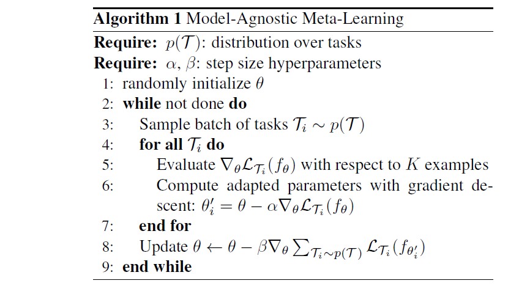

+ **背景? 提出了什么问题?**

+ **为了解决此问题提出了什么具体的idea?**

+ **如何从该idea形式化地对问题建模、简化并解决的?**

  假设我们的模型是 $f_{\theta}$, 参数为 $\theta$ 给定一个任务 $\tau_{i}$ 和其相应的数据集 $\left(\mathcal{D}_{\text {train }}^{(i)}, \mathcal{D}_{\text {test }}^{(i)}\right)$, 我们可以对模型参数进行一次或多次梯度下降. (下式中只进行了一次迭代):
  $$
  \theta_{i}^{\prime}=\theta-\alpha \nabla_{\theta} \mathcal{L}_{\tau_{i}}^{(0)}\left(f_{\theta}\right)
  $$
  其中 $\mathcal{L}^{(0)}$ 是由编号为0的小数据batch算得的loss.

  当然, 上面这个式子只针对一个特定的任务进行了优化. 而MAML为了能够更好地扩展到一系列任务上, 我们想要寻找一个在给定任意任务后**微调过程最高效的** $\theta^{*}$.

  现在假设我们采样了一个编号为1的数据batch用于更新元目标, 对应的loss记为 $\mathcal{L}^{(1)}$. $\mathcal{L}^{(0)}$ 和 $\mathcal{L}^{(1)}$ 的上标只代表着数据batch不同, 都是同一个目标方程计算得到的. 那么:
  $$
  \theta^{*}=\arg \min _{\theta} \sum_{\tau_{i} \sim p(\tau)} \mathcal{L}_{\tau_{i}}^{(1)}\left(f_{\theta_{i}^{\prime}}\right)=\arg \min _{\theta} \sum_{\tau_{i} \sim p(\tau)} \mathcal{L}_{\tau_{i}}^{(1)}\left(f_{\theta-\alpha \nabla_{\theta} \mathcal{L}_{\tau_{i}}^{(0)}\left(f_{\theta}\right)}\right)
  $$
  $$
  \theta \leftarrow \theta-\beta \nabla_{\theta} \sum_{\tau_{i} \sim p(\tau)} \mathcal{L}_{\tau_{i}}^{(1)}\left(f_{\theta-\alpha \nabla_{\theta}\mathcal{L}_{\tau_{i}}^{(0)}\left(f_{o}\right)}\right)
  $$
  https://lilianweng.github.io/lil-log/2018/11/30/meta-learning.html

  

  **湾湾李老师网课**:

  Meta Learning 就是找到Learning Algorithm $F$, 这个 $F$ 的能力是可以找到最优预测函数 $f^{\star}$.
  $$
  F(D_{train}) = f^{\star}
  $$
  Meta Learning 就是找到最好的 Learning Algorithm, 同样也可以有$loss$.

  以前的Initialization是从一个分布中采样, 现在就要学习一个Initialization.

  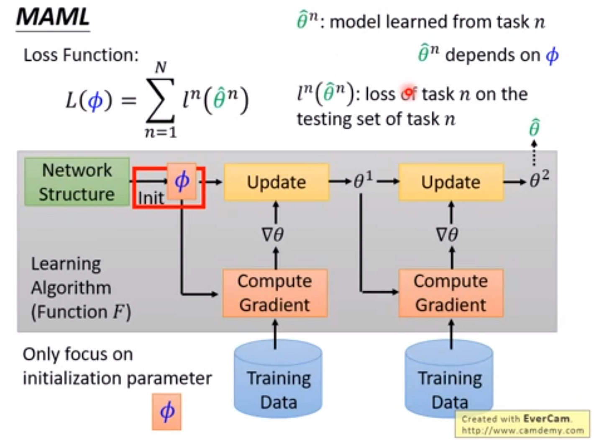

  各变量解释看上图. 每一个小任务都是训练的过程.

  + 与 Model Pre-training 的区别:

    Model Pre-training 损失函数的自变量是超参数(这里就是$\phi$), 但是MAML的损失函数自变量是 经过 $F$ 学习得到的 $f$ 的最优参数在test set上的损失.

    Model Pre-training 关注的是即刻的 $\phi$ 给进去loss如何, 而 MAML 关注的是经过训练后怎么样.

    MAML 并不在意Initialization: $\phi$ 在 training Task(set) 上的表现, 而是经过 $\phi$ 训练出来的 $f^{\star}$/$\hat{\theta}$ 的表现. $|$ 即对于学习器的loss(上面有): $l^i(\phi)$ 可能不是很好, 但是经过这个 $\phi$ 训练过后的 $\hat{\theta}$ 也就是 $l^i(\hat{\theta})$ 可能很好. 不同Task的$\hat{\theta}$当然不同:

    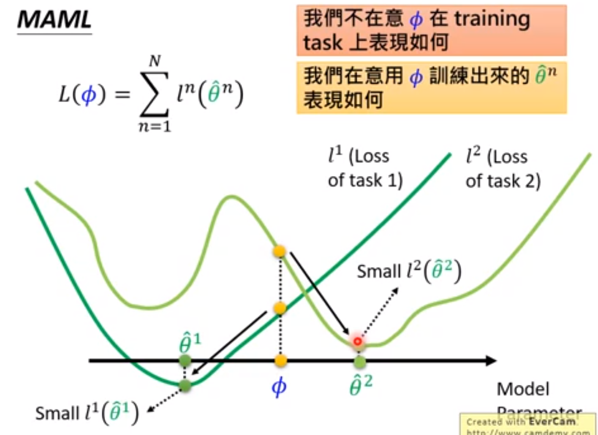

    

  + 训练细节:

    在训练的时候希望 Gradient Update 一次就到最优, 但是测试时可以Update多次.

    Few-Shot Learning 就希望只Update一次.

  + Toy Example:

    有一个 $y$, 一个Task就是从 $y$ 采样出不同的 $x$, 通过这些采样的来估测$y$的形式.
    $$
    y = a \sin (x+ b)
    $$
    不同的Task: 选不同的 $a, \ b$ 即可.

    + Model Pre-training 的结果:

      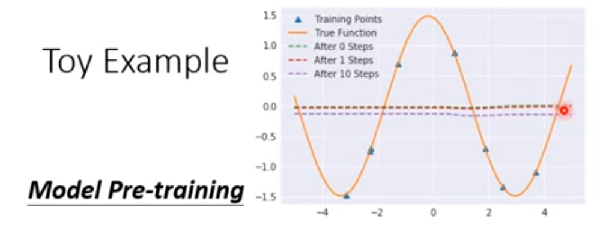

      因为拿 $\phi$ 要在所有 $y$ 上都表现好, 所有 $y$ 综合就是上图.

      

    + 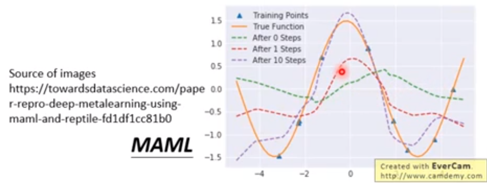

      

+ **理论方面证明的定理与推导过程?**

+ **这个任务/解决方法有什么意义?**

+ **对论文的讨论/感想?**


- **One-shot Learning with Memory-Augmented Neural Networks**, (2016), *Adam Santoro, Sergey Bartunov, Matthew Botvinick, Daan Wierstra, Timothy Lillicrap*. [[pdf\]](https://arxiv.org/pdf/1605.06065.pdf) [[code\]](https://github.com/vineetjain96/one-shot-mann)

### MANN

- [x] **MANN** (2016) [[paper](https://arxiv.org/pdf/1605.06065.pdf)] [[code](https://github.com/tristandeleu/ntm-one-shot), [code (tf)](https://github.com/hmishra2250/NTM-One-Shot-TF)]
    - Santoro et al. "One-shot Learning with Memory-Augmented Neural Networks"


| 核心在哪? | 精读? 代码? | 关键词? | 亮点? | 阅读时间? |
| --------- | ----------- | ------- | ----- | --------- |
|           |             |         |       |           |

---

+ **背景? 提出了什么问题?**
+ **为了解决此问题提出了什么具体的idea?**
+ **如何从该idea形式化地对问题建模、简化并解决的?**
+ **理论方面证明的定理与推导过程?**
+ **这个任务/解决方法有什么意义?**
+ **对论文的讨论/感想?**


### PFA

- [x] **PFA** (CVPR 2018) [[paperswithcode](https://paperswithcode.com/paper/few-shot-image-recognition-by-predicting)]
    - Qiao et al. "Few-Shot Image Recognition by Predicting Parameters from Activations"


| 核心在哪? | 精读? 代码? | 关键词?                    | 亮点?                    | 笔记时间? |
| --------- | ----------- | -------------------------- | ------------------------ | --------- |
| 2. Model  | 精读        | 激活值 -> 分类器权值的预测 | 采样，线性近似，混合策略 |           |

---

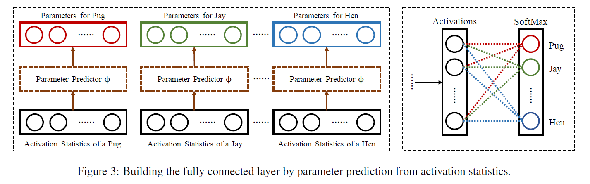 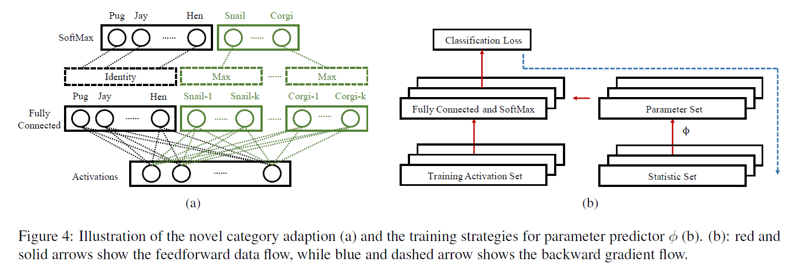


+ **背景? 提出了什么问题?**

  > We argue that a good classifier should **have the following properties:** 
  >
  > **(1)** It achieves reasonable performance on $\mathcal{C}_{\text {few}}$.
  > **(2)** Adapting to $\mathcal{C}_{\text {few }}$ does not degrade the performance on $\mathcal{C}_{\text {large }}$ significantly (if any).
  > **(3)** It is fast in inference and adapts to few-shot categories with little or zero training, i.e., an efficient lifelong learning system.
  >
  > However, due to the limited number of samples in $\mathcal{D}_{\text{few}}$ and the **imbalance** between $\mathcal{D}_{\text {large}}$ and $\mathcal{D}_{\text {few}}$, parametric models usually **fail to learn well from the training samples.**
  >
  > On the other hand, many **non-parametric** approaches such as nearest neighbors can adapt to the novel concepts easily without severely forgetting the original classes. **But this requires careful designs of the distance metrics,** which can be difficult and sometimes empirical. To remedy this, some previous work instead adapts feature representation to the metrics by using Siamese networks.
  >
  > As we will show later through experiments, these methods do not fully satisfy the properties mentioned above.

  $\mathcal{D}_{\text {large}}$ 就是support set, 对应的 $\mathcal{D}_{\text{few}}$ 是query set.

  + how to **re-parameterize** the last fully connected layer to include the novel categories under the few-shot constraints, *i.e.*, for each category in $\mathcal{C}_{few}$ we have only a few examples.

  we believe **the activations and the parameters** have similar **local and global structure** in their respective space.

$\mathcal{D}_{\text {large}}$ 上学到的, 泛化到 $\mathcal{C}_{\text {few}}$.

+ **为了解决此问题提出了什么具体的idea?**

  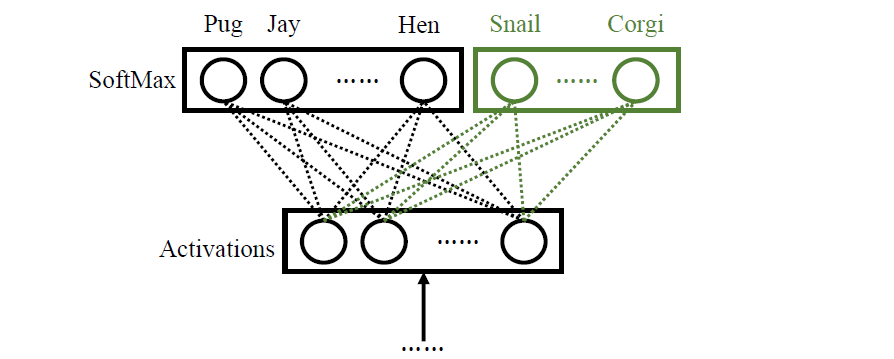

  上图是最后的全连接层和softmax层.

  + $\mathbf{w}_y \in \mathbb{R}^n$ 是全连接层对应类别 $y$ 的参数.
  + $\mathbf{a} (x) \in \mathbb{R}^n$ 是图像 $x$ 的 在全连接层之前的 激活层值.

  > how to **re-parameterize** the last fully connected layer to include the novel categories under the few-shot constraints, *i.e.*, for each category in $\mathcal{C}_{few}$ we have only a few examples.

  解决上述挑战就是:

  **使用激活值直接预测 $\mathbf{w}_y$**, $i.e.$, $\mathcal{A}_{y}=\left\{\mathbf{a}(x) \mid x \in \mathcal{D}_{\text {large }} \cup \mathcal{D}_{\text {few }}, Y(x)=y\right\}, \text { where } Y(\cdot) \text { denotes the category of the image. }$

  

  + $\overline{\mathbf{a}}_{y} \in \mathbb{R}^{n}$ 是 $\mathcal{A}_y$ 中所有元素的均值.

  **直觉上, 想让 $\mathbf{w}_y \cdot \mathbf{a}_y$ 尽可能大.**

+ **如何从该idea形式化地对问题建模、简化并解决的?**

  **直觉上, 想让 $\mathbf{w}_y \cdot \mathbf{a}_y$ 尽可能大.**

  > To verify this intuition, we use [**t-SNE**](https://en.wikipedia.org/wiki/T-distributed_stochastic_neighbor_embedding) to **visualize the neighbor embeddings** of the activation statistic $\overline{\mathbf{a}}_{y}$ and the parameters $\mathbf{w}_{y}$ for each category of a pre-trained deep neural network, as shown in Figure $2$. Comparing them and we observe a high similarity **in both the local and the global structures.** More importantly, **the semantic structures** are also **preserved** in both activations and parameters, indicating **a promising generalizability to unseen categories.**

  依据: 通过**t-SNE**将激活值可视化后, $\overline{\mathbf{a}}_{y}$ 与对应类别的分类权重 $w_y$ 非常接近.

  使用 the semantic structures. **学到一个好的 category-agnostic**
  **mapping**: from the activations to the parameters given a good feature extractor $a( \cdot )$. 这个mapping由神经网络来学.

  

  
  $$
  \text { parameter predictor } \phi: \overline{\mathbf{a}}_{y} \rightarrow \mathbf{w}_{y}
  $$

  + **学习过程**: $\phi$ 在 $y \in \mathcal{C}_{large}$ 就是 support set
    $$
    \mathcal{L}(\phi)=\sum_{(y, x) \in \mathcal{D}_{\text {large }}}\left[-\phi\left(\overline{\mathbf{a}}_{y}\right) \mathbf{a}(x)+\log \sum_{y^{\prime} \in \mathcal{C}_{\text {large }}} e^{\phi\left(\overline{\mathbf{a}}_{y^{\prime}}\right) \mathbf{a}(x)}\right]+\lambda\|\phi\|
    $$
    但是, 因为query set上可能每一类只有一个, 这样 $\overline{\mathbf{a}}_{y}$ 可能不具有代表性了, 解决方法就是**采样:**

    one-shot, 构建新的集合, 并从中**取一个 统计量:**
    $$
    \mathbf{s}_{y} \in \mathcal{A}_{y} \cup \overline{\mathbf{a}}_{y}
    $$
    **关键:** 以 $p_{mean}$ 的概率取 $\overline{\mathbf{a}}_{y}$, 反之取 $\mathcal{A}_y$ 中的元素.

    $S_{large} = \left\{\mathbf{s}_{1}, \ldots, \mathbf{s}_{\mid \mathcal{C}_{\text {large}}|}\right\}$

    新的损失函数:
    $$
    \mathcal{L}(\phi)=\sum_{(y, x) \in \mathcal{D}_{\operatorname{large}}} \mathbb{E}_{S_{\mathrm{large}}}\left[-\phi\left(\mathbf{s}_{y}\right) \mathbf{a}(x)+\log \sum_{y^{\prime} \in \mathcal{C}_{\operatorname{large}}} e^{\phi\left(\mathbf{s}_{y^{\prime}}\right) \mathbf{a}(x)}\right]+\lambda\|\phi\|
    $$
    以上, models the sampling from one-shot and mean activations.

  + 后验:
    $$
    P(y \mid x)=e^{\mathbb{E}_{S}\left[\phi\left(\mathbf{s}_{y}\right) \mathbf{a}(x)\right]} /\left(\sum_{y^{\prime} \in \mathcal{C}} e^{\mathbb{E}_{S}\left[\phi\left(\mathbf{s}_{y^{\prime}}\right) \mathbf{a}(x)\right]}\right)
    $$
    为了计算快速, 简化 $\phi$ 为线性映射:
    $$
    \begin{aligned}
    P(y \mid x) &=e^{\mathrm{a}(x) \cdot \phi\left(\mathbb{E}_{S}\left[\mathbf{s}_{y}\right]\right)} /\left(\sum_{y^{\prime} \in \mathcal{C}} e^{\mathbf{a}(x) \cdot \phi\left(\mathbb{E}_{S}\left[\mathbf{s}_{y^{\prime}}\right]\right)}\right) \\
    &=e^{\mathbf{a}(x) \cdot \Phi \cdot \mathbb{E}_{S}\left[\mathbf{s}_{y}\right]} /\left(\sum_{y^{\prime} \in \mathcal{C}} e^{\mathbf{a}(x) \cdot \Phi \cdot \mathbb{E}_{S}\left[\mathbf{s}_{y^{\prime}}\right]}\right)
    \end{aligned}
    $$
    上述简化(直接线性的方法) 和 采样的方法结合使用.

    其中 $\mathbb{E}_S\left[s_{y}\right]$ 可以在训练时提前计算好**并保存**下来. 在小样本数据集上进行训练时, 对于新的类别需要更新 $\mathbb{E}_S\left[s_{y}\right]$, 但由于小样本数量较少, 计算得到的$\mathbb{E}_S\left[s_{y}\right]$可靠性不高, 采用了一种混合策略:

    + 对于大规模数据集中的类别, 直接使用训练得到的 $\mathbb{E}_S\left[s_{y}\right]$ 简化的线性近似.
    + 对于小样本数据集中的类别, 使用类别 $y$ 对应的所有统计值 $s_{y}$ 与 query set图像 $x^{\prime}$ 的激活值 $a\left(x^{\prime}\right)$ **内积的最大值**, 来作为分类器的输出. 该过程如下所示:

    > 
    >
    > **(4a)** For each novel category in $C_{few}$, we compute the **maximal** response of the activation of the test image to **the parameter set predicted from each activation in the statistic set of the corresponding novel category in $C_{few}$.**
    >
    > We use them as the inputs to the SoftMax layer to compute the probabilities.

    

  + **总结:**

    利用一个网络 $\phi$, 根据每类样本的激活向量平均值 $\overline{\mathbf{a}}_{y}$ (对于 query set 中的元素有采样), 来预测分类器中全连接层的权重.

    

+ **理论方面证明的定理与推导过程?**

+ **这个任务/解决方法有什么意义?**

+ **对论文的讨论/感想?**

  如果把线性变换矩阵 $\Phi$ 设为单位矩阵, 那么:
  $$
  a(x) \cdot \Phi \cdot \mathbb{E}_{S}\left(s_{y}\right) \Rightarrow a(x) \cdot \mathbb{E}_{S}\left(s_{y}\right)
  $$
  相当于计算 $a(x)$ 和 $\mathbb{E}_{S}\left(s_{y}\right)$ 之间的余弦相似性, 对于类别表征 (或者说原型 prototype) 的计算中增加了一个随机采样的过程和一个可学习的线性变换 $\phi$, 当然如果不把 $\phi$ 近似为线性变换, 其性能可能会更高, 但计算复杂度也会大幅上升.


### TADAM (难)

- [x] **TADAM** (NIPS 2018) [[paperswithcode](https://paperswithcode.com/paper/tadam-task-dependent-adaptive-metric-for)]
    - Boris N. Oreshkin et al. "TADAM: Task dependent adaptive metric for improved few-shot learning"


| 核心在哪? | 精读? 代码? | 关键词? | 亮点?                                             | 笔记时间? |
| --------- | ----------- | ------- | ------------------------------------------------- | --------- |
|           | 精读        |         | 1. scale metric, 2. TEN结构, 3. 辅助任务合作训练. |           |

---

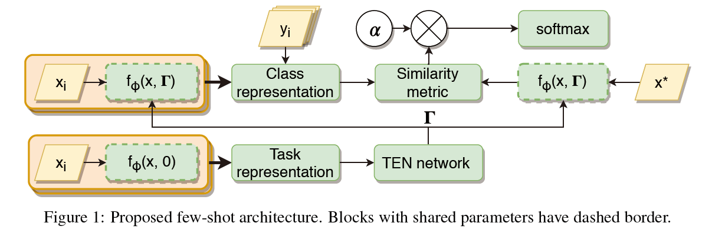

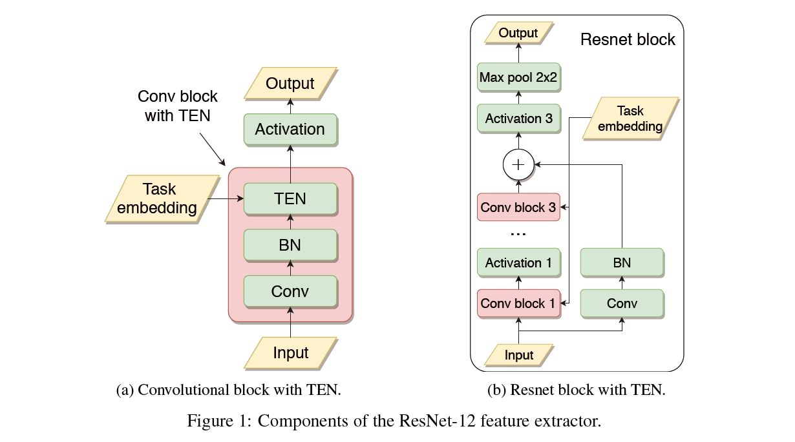 

+ **背景? 提出了什么问题?**

  学到一个context的度量空间, 即学习一个合适的相似性度量, 提取输入数据的特征后, 将其映射到similarity space.

  similarity metric 和 cost function 之间的 non-trivial interaction 可以通过 scaling 来提高性能.


+ **为了解决此问题提出了什么具体的idea?**

  metric scaling and metric task conditioning

  + M-shot, K-way.

  + **feature extractor**:
    $$
    f_{\phi}: \mathbb{R}^{D_{\mathbf{x}}} \rightarrow \mathbb{R}^{D_{\mathbf{z}}}
    $$
    这里 $f_{\phi} (x)$ 可以被直接用来解决问题 (比如matching, prototype就是这么做的).

  + **similarity measure** $d: \mathbb{R}^{D_{\mathbf{z}} \times D_{\mathbf{z}}} \rightarrow \mathbb{R}$

    $d$ 并不满足度量的基本性质 (non-negativity, symmetry, subadditivity).

    

  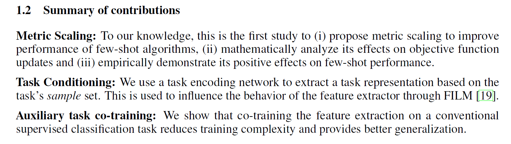

  + 采用 metric scaling, 并数学上分析.
  + task encoding network.
  + co-training the feature extraction on a conventional supervised classification task.

  

+ **如何从该idea形式化地对问题建模、简化并解决的?**

  + **model**:

    **1 scale** the distance metric, **乘一个 $\alpha$,** $\alpha \ d(\cdot, \cdot)$.

    在计算完距离度量后学习一个scaling factor.
    
    此时该metric的学习过程, the class-wise cross-entropy loss function:
    $$
    J_{k}(\phi, \alpha)=\sum_{\mathbf{x}_{i} \in \mathcal{Q}_{k}}\left[\alpha d\left(f_{\phi}\left(\mathbf{x}_{i}\right), \mathbf{c}_{k}\right)+\log \sum_{j} \exp \left(-\alpha d\left(f_{\phi}\left(\mathbf{x}_{i}\right), \mathbf{c}_{j}\right)\right)\right]
$$
    其中 $\mathcal{Q}_k$ 是query set, 第 $k$ 类.
    
    对 $\phi$ 求导, (就是内函数外函数导数)有 注意 $\alpha$ 提到外面了:
    $$
    \frac{\partial}{\partial \phi} J_{k}(\phi, \alpha)=\alpha \sum_{\mathbf{x}_{i} \in \mathcal{Q}_{k}}\left[\frac{\partial}{\partial \phi} d\left(f_{\phi}\left(\mathbf{x}_{i}\right), \mathbf{c}_{k}\right)-\frac{\sum_{j} \exp \left(-\alpha d\left(f_{\phi}\left(\mathbf{x}_{i}\right), \mathbf{c}_{j}\right)\right) \frac{\partial}{\partial \phi} d\left(f_{\phi}\left(\mathbf{x}_{i}\right), \mathbf{c}_{j}\right)}{\sum_{j} \exp \left(-\alpha d\left(f_{\phi}\left(\mathbf{x}_{i}\right), \mathbf{c}_{j}\right)\right)}\right]
$$
    

    上式:

    直观上, $\alpha$ 有两个影响:
    
1. 梯度的全局放缩.
    2. 增加 RHS 括号内第二项权重.

    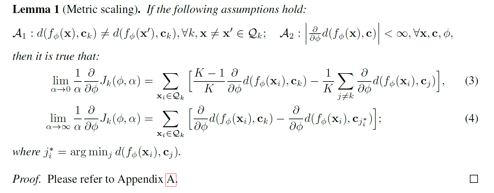

    + $\alpha \rightarrow 0$ 时, 注意(3)式 RHS两项的正负号:

      + 第一项 $\frac{K-1}{K} \frac{\partial}{\partial \phi} d\left(f_{\phi}\left(\mathbf{x}_{i}\right), \mathbf{c}_{k}\right)$:
    
        最小化 和第 $k$ 类 prototype 的距离.
        
      + 第二项负号, 所以是最大化和其他类的prototype.
      
    + $\alpha \rightarrow \infty$ 时, 注意RHS:
    
      + 第一项一样.
      + 第二项是最大化 那个最接近的错误类的prototype.
    
    
    
    **2 Task conditioning**
    
    特征提取 $f_{\phi}$ 应是task-independent. 通过任务的样例集来提取任务表示.
    $$
    f_{\phi}(\mathbf{x}, \Gamma)
    $$
    其中task representation的参数表达. is related to **the FILM conditioning layer** [19] and **conditional batch normalization** [3,18] of the form $h_{\ell+1}=\gamma \odot h_{\ell}+\beta$, where $\gamma$ and $\beta$ are **scaling and shift** vectors applied to the layer $h_{\ell}$.
    
    使用the mean of the class prototypes作为任务上的prototype.
    
    + **task embedding network (TEN):**
    
      predict layer-level element-wise scale and shift vectors $\gamma$, $\beta$ for each convolutional layer in the feature extractor.
    
    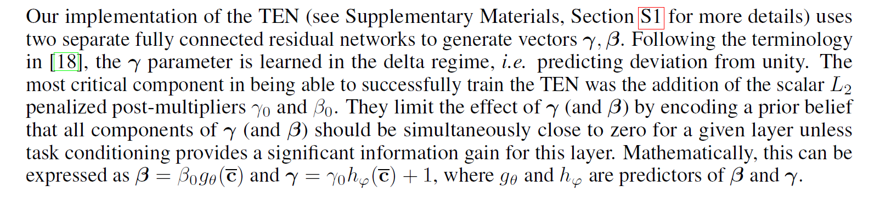 仔细看才看得懂.


**1)** 通过Auxiliary task co-training的训练方式训练feature extractor, 为support set和query set中的样例抽取特征得到class representation. 其中feature extractor中采用的是ResNet-12结构.

**2)** 借鉴Prototypical Network的思想, 将每类的样例得到的向量表示求平均得到每一类的原型, 随后使用类原型的平均值作为task representation, 将这个任务表示作为输入, 到TEN network中, 然后根据它的数据更新feature extractor提取的特征, 将任务特有的特征与样例提取的特征相结合, 使得support set和query set的class representation更具有泛化性.

**3)** 根据上一步的class representation计算similarity metric, 随后乘一个可学习的系数 $\alpha$ 来缩放距离度量, 增强模型的可适性. 最后将这步输出投入到softmax中得到图片的最终分类.


+ **理论方面证明的定理与推导过程?**
  + *Lemma 1*, Appendix A.
+ **这个任务/解决方法有什么意义?**
+ **对论文的讨论/感想?**


